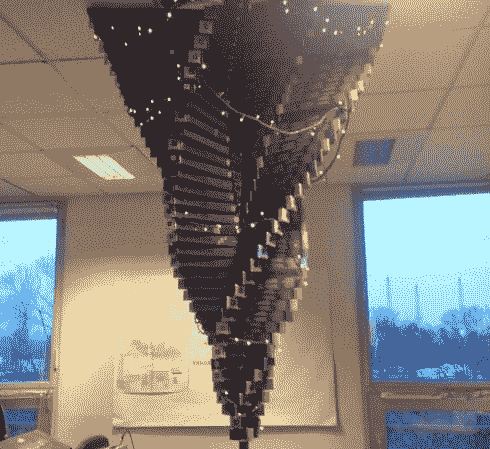

# 奈斯派索管制成的倒置圣诞树

> 原文：<https://hackaday.com/2013/12/12/inverted-christmas-tree-made-of-nespresso-tubes/>

当你把几个极客放在一个房间里，房间里有窗帘杆、240 根 Nespresso 管、一些木板、一些胶带、童话灯和一个树莓派，会发生什么？嗯，[显然是这个！](https://www.facebook.com/sapinoo)

没有太多关于他们如何制作的信息，但是有一个相当广泛的照片库。当我们考虑我们浪费了多少包装时，很高兴看到一些被重新用于一个项目，至少是暂时的！Nespresso 管看起来很漂亮，这当然适合这个项目，但我们真正的问题是谁喝了所有的咖啡…

LED 童话灯是使用树莓皮模型 B 语音控制的，没有什么太花哨，但一个很好的附加效果。休息过后，看看视频——语音指令是法语的！

[https://www.youtube.com/embed/AlDX5EW3_f0?version=3&rel=1&showsearch=0&showinfo=1&iv_load_policy=1&fs=1&hl=en-US&autohide=2&wmode=transparent](https://www.youtube.com/embed/AlDX5EW3_f0?version=3&rel=1&showsearch=0&showinfo=1&iv_load_policy=1&fs=1&hl=en-US&autohide=2&wmode=transparent)

至于声控圣诞灯，我们仍然认为这种[户外声控圣诞树](http://hackaday.com/2012/12/19/sound-reactive-christmas-tree-makes-folks-happy/)可能是最棒的！

【感谢脚轮！]