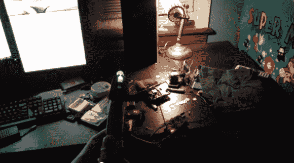

# 现实生活中用于家庭自动化的声波螺丝刀

> 原文：<https://hackaday.com/2013/12/12/real-life-sonic-screwdriver-for-home-automation/>

有哪位医生喜欢那里吗？[Pat]刚刚把他的家庭自动化项目发给了我们… [使用声波螺丝刀！](http://pathartl.me/blog/2013/12/07/raspberry-pi-automation-real-life-sonic-screwdriver/)

自从他在 2012 年 2 月初预购了他的树莓派，他就知道他想尝试一下家庭自动化。最简单的方法是使用 X10 插座，但是一个插座要 20 多美元，不是那么实惠。相反，他设法在亚马逊上找到了一个相当便宜的系统——射频控制商店。一包 5 个的只需要 35 美元。

这是一个非常基本的系统:五个插座，遥控器上有五个按钮。他所要做的就是连接 Raspberry Pi，通过将 GPIO 引脚设置为高电平来模拟按钮按压，很快，一个简单而有效的家庭自动化设置就完成了。

这是开始变得有趣的地方。不幸的是，不像一个实时领主，[帕特]没有从零开始建立他的声波。相反，他找到了一个通用遥控器——模仿[史密斯]的索尼克。在 Pi 上添加另一个 RF 接收器，一个基于网络的界面来扩展范围，然后 bam，你就有了一个极客但很棒的家庭自动化设置。

休息后留下来看看它的运行吧！

[https://www.youtube.com/embed/YP_TDsSkYiI?version=3&rel=1&showsearch=0&showinfo=1&iv_load_policy=1&fs=1&hl=en-US&autohide=2&wmode=transparent](https://www.youtube.com/embed/YP_TDsSkYiI?version=3&rel=1&showsearch=0&showinfo=1&iv_load_policy=1&fs=1&hl=en-US&autohide=2&wmode=transparent)

有点让我们想起我工作时用的 RFID 声波！不过我更喜欢[滕南特版……](https://www.youtube.com/watch?v=vE911QjvX9c)