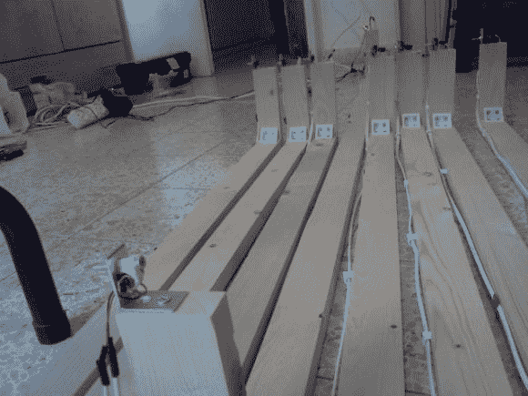

# 便携式音乐楼梯

> 原文：<https://hackaday.com/2013/12/13/portable-musical-stairs/>

[Amir]最近完成了一个非常酷的项目——便携式音乐楼梯！他设计并制造了它，这样它就可以临时安装在学校里为自闭症儿童进行音乐治疗——一项老少皆宜的有趣活动！

该系统利用激光和光电传感器，内置带有灵敏度电位计的数字输出，这使得 Arduino Leonardo 非常容易解读。他们使用 2 乘 4 系统的原因是因为楼梯的宽度。在 1.75 米宽的范围内，激光仅偏移 1 度就会导致大约 3 厘米的误差！

在软件方面，Arduino 充当计算机的 HID 输入来创建声音。[阿米尔]在他的网站[makeysoundy.com](http://makeysoundy.com/?page_id=4)上放了一个免费的声音样本，我们必须说，这非常有趣！您可以将音符分配到不同的键，这使得制作类似的项目变得非常容易！

休息后留下来看看活动中的楼梯！

[https://www.youtube.com/embed/jagcZELU1-w?version=3&rel=1&showsearch=0&showinfo=1&iv_load_policy=1&fs=1&hl=en-US&autohide=2&wmode=transparent](https://www.youtube.com/embed/jagcZELU1-w?version=3&rel=1&showsearch=0&showinfo=1&iv_load_policy=1&fs=1&hl=en-US&autohide=2&wmode=transparent)

虽然这是一个伟大的项目，也许[阿米尔]应该看看[音乐楼梯](http://hackaday.com/2013/11/11/hackprinceton-piano-stairs/)一些普林斯顿大学的学生上个月提出的！