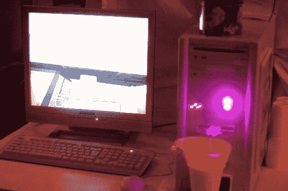

# Roboxotica(维也纳 Barbot 节)

> 原文：<https://hackaday.com/2013/12/13/roboxotica-barbot-festival-in-vienna/>

刚刚过去的一周是今年的【2013 年机器人大会！这项年度活动是世界上第一次，也可能是最棒的鸡尾酒机器人节！

[Roboexotica](http://en.wikipedia.org/wiki/Roboexotica) 于 15 年前在旧金山成立，汇集了来自世界各地的科学家、黑客和艺术家，致力于开发最棒的饮料配制技术。这也是一个讨论创新、科幻小说和未来机器人世界的机会——当然是在利用一些机器人之后！

上面的照片是今年最受欢迎的机器人之一——它被称为[《我的世界》长尾机器人](http://www.youtube.com/watch?v=jMTjbD4CfUY)。它从软盘驱动器中分配酒，但只有当你在《我的世界》游戏中控制它的时候！

Roboxotica 上的更多机器人可以在[主网站上找到。](http://www.roboexotica.org/?exhibition2013)我们认为第二喜欢的是兔子机器人。它排泄花生——颗粒条状食物中最大的一种。

休息后留下来看看《我的世界》Cocktailbot 的行动！

[https://www.youtube.com/embed/jMTjbD4CfUY?version=3&rel=1&showsearch=0&showinfo=1&iv_load_policy=1&fs=1&hl=en-US&autohide=2&wmode=transparent](https://www.youtube.com/embed/jMTjbD4CfUY?version=3&rel=1&showsearch=0&showinfo=1&iv_load_policy=1&fs=1&hl=en-US&autohide=2&wmode=transparent)

那么哪个更好呢？ [Barbot 2013](http://hackaday.com/2013/11/09/robots-of-barbot-2013/) ，还是 Roboexotica 2013？