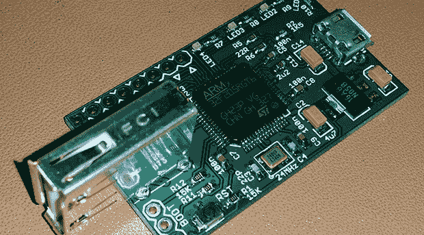

# PS4 键盘和鼠标操作的 UsbXlater

> 原文：<https://hackaday.com/2013/12/13/usbxlater-for-ps4-keyboard-and-mouse-action/>

[弗兰克·赵]——一个令人敬畏的家伙，一个无意中的 Hackaday 贡献者，一个 Adafrut 研究员——已经开发出一种设备，可以在 Playstation 4 游戏中使用键盘和鼠标。他称之为 UsbXlater，即使 Frank 不能让它和他的 PS4 一起工作，它仍然会是一个很棒的工具。

板上有两个 USB 端口和一个 STM32F2 微控制器。该微处理器提供了一个 USB 主机接口和一个 USB 设备接口，使其能够将鼠标移动和按键转换为 PS4 可以理解的内容。虽然这个项目最初是为了在[Frank]闪亮的新 PS4 上使用键盘和鼠标而设计的，但它现在还不太好用。他正在寻找一些游戏玩家/开发人员来帮助他搞清楚键盘/鼠标、UsbXlater 和 PS4 之间的通信。

当然，即使这个设备从来没有被用于它的设计目的，它仍然是一个非常非常有趣的工具。通过两个 USB 端口，UsbXlater 可以充当 USB 设备和主机的信号发生器，分析 USB 流量，或提供其他尚未想到的应用程序。

[Frank]正在努力弄清楚 PS4 协议，所以如果你有一些 USB 技能，请随时向他要一个空白 PCB，尽管偏好会用它玩游戏的人和有 USB 流量分析器的人。如果你缺乏 USB 开发的技能，[Frank]还在为他的设备寻找一个更好的名字。