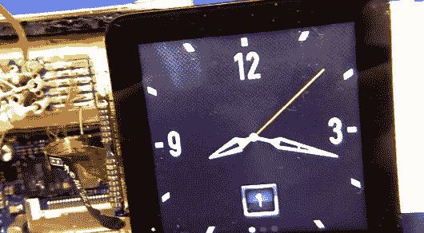

# 逆向工程液晶显示器

> 原文：<https://hackaday.com/2013/12/14/reverse-engineering-an-lcd-display/>

当前的市场允许业余爱好者很容易地找到便宜的、记录良好的显示器，但是如果你想与更复杂的东西交互，比如 iPod Nano 6 的屏幕，该怎么办呢？[Mike]给了我们一个详细而有见地的视频,展示了他在几乎没有文档的情况下对设备进行逆向工程的过程。在这里，他介绍了最初的调查，人们在网上搜索任何可用的信息。在[迈克的]例子中，显示器使用了 MIPI D-PHY 接口，这是他从未使用过的。他了解到 [MIPI 联盟](http://www.mipi.org/)将提供设计规格，以换取一份签署的 NDA(保密协议)和 8000 美元的费用。很好。

[Mike]展示了一些重要的硬件技术，解决了一些极其困难的焊接问题，以便建立一个合适的测试平台。然后，他演示了如何使用一个相当棒的示波器来更好地理解显示协议。我们发现看到视频信号显示为波形非常有趣，特别是当他展示如何计数单个二进制值时。他用示波器发现的信息量是惊人的，证明这些小装置比它们看起来更复杂。

[通过黑客工具]

[https://www.youtube.com/embed/7TedIzmguP0?version=3&rel=1&showsearch=0&showinfo=1&iv_load_policy=1&fs=1&hl=en-US&autohide=2&wmode=transparent](https://www.youtube.com/embed/7TedIzmguP0?version=3&rel=1&showsearch=0&showinfo=1&iv_load_policy=1&fs=1&hl=en-US&autohide=2&wmode=transparent)