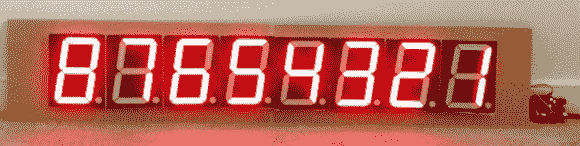

# 控制高压 7 段显示器

> 原文：<https://hackaday.com/2013/12/15/controlling-high-voltage-7-segment-displays/>

MAX7219 是你箱子里那种“做了就做了”的零件之一。如果你不熟悉，这个芯片可以用来控制 7 段显示器，8×8 矩阵显示器，甚至一堆随机发光二极管。你通过一个简单的串行接口与它对话，它会处理你不想处理的任务，比如多路复用和调制。然而，并非所有的显示器都是一样的，所以[Raj]写了一篇文章，展示他如何使用 [MAX7219 来控制高压 7 段显示器。](http://embedded-lab.com/blog/?p=7628)

MAX7219 的规格只允许 5V 的输入电压，这将驱动器输出限制在 4V 左右，当使用内部串联 led 的大显示器时，可能会引起问题。[Raj]的解决方案允许 MAX7219 以高达 24V 的组合正向电压控制显示器，并且作为额外的好处，该电路保持与现有微控制器库的兼容性。我们认为这可能是一个很好的小技巧，下次你需要控制大型记分牌显示器时可以随身携带。

该电路在中间驱动器的帮助下工作，对显示器的电压进行电平转换，既提供高电压，又保护 MAX7219 的输入。这种电路的一个缺点是失去了 MAX7219 的恒流特性，要求每个分段连接包括一个限流电阻。我们很欣赏这种设计对默认状态的关注，因为你不会希望所有的 led 灯在启动时都亮着！