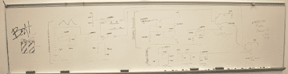

# 模拟鼓形机

> 原文：<https://hackaday.com/2013/12/17/analog-drum-machine/>

这个[模拟架子鼓](http://www.instructables.com/id/Analog-Beat-Box/)项目合成了一个打拍子的鼓和小军鼓。它将几个模拟电路放在一起进行时序和合成。

节拍定时是用来产生“鲨鱼波”的滞后振荡器的产物，鲨鱼波是对[张弛振荡器](http://en.wikipedia.org/wiki/Relaxation_oscillator)输出的友好称呼。可以使用比较器将该波形与设定点进行比较，以产生一个缓慢的方波来记录鼓声。

使用另一个滞后振荡器合成底鼓，但频率更高，产生 265 Hz 的类似三角形的波形，提供低音。然而，该圈套使用 BJTpn 结提供的白噪声，该白噪声被反向偏置，然后被放大。你能认出这个晶体管，因为它的集电极没有连接。

由此产生的小军鼓和底鼓波形由两个晶体管选通至输出端。控制这些门允许用户创建一个鼓点。休息之后，请观看视频演示和构建演示。

[https://www.youtube.com/embed/bdwKVOW-1xU?version=3&rel=1&showsearch=0&showinfo=1&iv_load_policy=1&fs=1&hl=en-US&autohide=2&wmode=transparent](https://www.youtube.com/embed/bdwKVOW-1xU?version=3&rel=1&showsearch=0&showinfo=1&iv_load_policy=1&fs=1&hl=en-US&autohide=2&wmode=transparent)