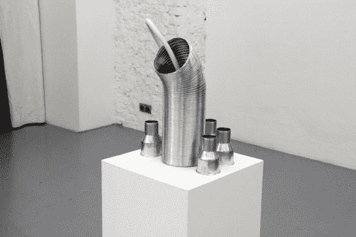

# 低温电话:干冰驱动的音乐装置

> 原文：<https://hackaday.com/2013/12/17/cryophone-a-dry-ice-powered-musical-installation/>

[Dmitry]有点像工业艺术家/黑客，他最近完成了这个有趣的互动音频展览，名为“低温电话”。

如你所知，干冰非常有趣。当放入水中时，它会迅速从固态升华为气态，释放出二氧化碳气体，并导致剧烈(有时甚至是剧烈)的温度变化。[德米特里的]项目试图放大这些反应的声音，创造音乐(？)使用来自系统中传感器输入的数据。他使用压电元件、温度传感器和 Arduino 从各种传感器生成算法组合，然后 Mac Mini 将其合成并输出为 6 个通道的音频。

结果是一个怪异的噪音集合，在鬼屋或恐怖电影中会很好。休息过后，你可以自己听听，如果你错过了，看看另一个独特的、基于音频的艺术装置:“conus”

[https://player.vimeo.com/video/82023532](https://player.vimeo.com/video/82023532)