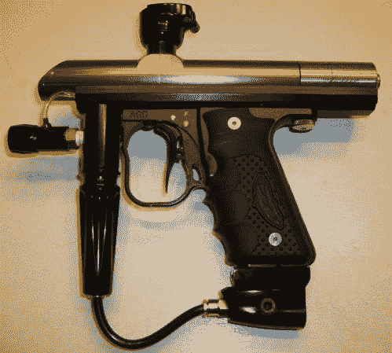

# SMAC 弹夹:蜘蛛的最小模拟控制彩弹枪

> 原文：<https://hackaday.com/2013/12/18/smac-mag-spiders-minimal-analog-control-paintball-gun/>

【蜘蛛！]对彩弹标记万神殿[的贡献是 SMAC](http://www.mcarterbrown.com/forums/custom-projects-custom-questions/72537-smac-mag-spider-s-minimal-analog-control.html) :气枪设计公司一直受欢迎的[汽车制造商之一](http://en.wikipedia.org/wiki/Automag_(paintball_marker))的独特修订。我们需要我们的线人[Russell]提供一些关于 Automag 发展的背景，因为该品牌已经作为一个流行的黑客平台服务了近 20 年。最常见的是“Pneumag”改造，它将原始的全机械扳机转换为扳机驱动气压缸来发射枪支的版本。

根据[Russell]的说法，气枪的扳机必须在每次射击之间完全释放，以适当地给发射室重新充电。如果没有完全释放，枪可能会将多余的球装入枪管，导致不愉快的后果。电控解决了这个问题，但是【蜘蛛！]倾向于采用模拟解决方案，这种解决方案比预制微控制器板更能体现“少即是多”的理念。他围绕一个用作[延迟重触发](http://home.cogeco.ca/~rpaisley4/LM555.html#27)的 556 定时器构建了电路，但对[做了一些修改](http://www.mcarterbrown.com/gallery/data/1070/SMACcircuit1.JPG)。

荡经【蜘蛛！]的论坛帖子，了解更多详细信息、一组图片和一份材料清单。微控制器替代品？我们会保护你的。