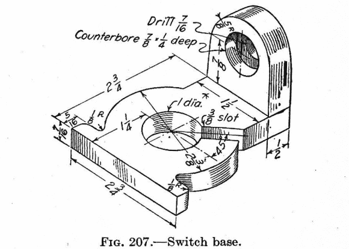
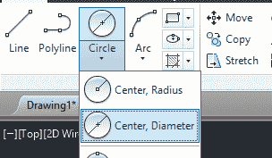
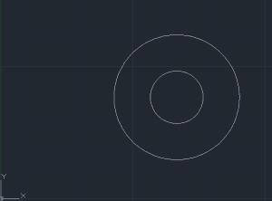
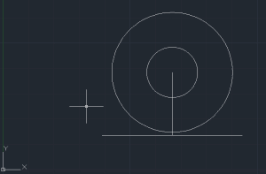
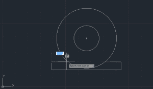
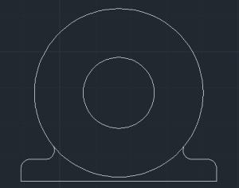
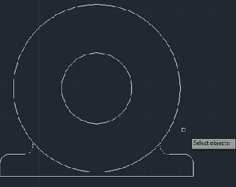
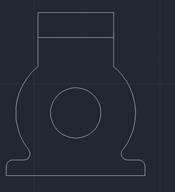

# 3D 打印:用 AutoCAD 制作一个东西，第一部分

> 原文：<https://hackaday.com/2013/12/18/3d-printering-making-a-thing-with-autocad/>

八足动物和无用的塑料小玩意滚蛋。又到了学习如何用 3D 设计工具制作东西的时候了。这一周，我们用 AutoCAD 制作一些东西。这是一个惊人的软件，每个座位的价格是 4000 美元*。*对任何家庭修理工来说都贵得离谱，但如果你去的是工程专业的大学，校园里某个地方有一个计算机实验室，里面有运行 AutoCAD 的机器。

上周我们看了一下用 OpenSCAD 制作东西的[。AutoCAD 非常非常不同。OpenSCAD 有点像编程，AutoCAD 只是丁字尺、三角形、直边的数字版本，当你不把他们的绘图设备称为“铅夹”时，人们会变得傲慢。](http://hackaday.com/2013/12/11/3d-printering-making-a-thing-with-openscad/)

我将本教程分为两部分:现在你正在阅读在 AutoCAD 中绘制 2D 物体的教程。这个周末，我将发表 2D 物体转化为 3D 可打印部件的成果。继续阅读如何在 AutoCAD 中创建 2D 对象。

#### 我们的事

因为演示了创建 3D 可打印对象的不同方法，而不是每次都使用相同的对象，所以我们再次使用这张图。那幅画已经有将近 100 年的历史了，但它仍然是一个很好的介绍，介绍了如何绘制图片并将其转化为 3D 可打印对象。

#### 让我们开始吧。

我们将从绘制零件的顶部透视图开始。

 从画两个圆开始。从“主页”选项卡，点击“圆”下拉菜单并选择“中心，直径”。这将允许您通过选择一个点作为圆心并输入一个直径数字来绘制一个圆。从我们近 100 年来绘制的东西来看，我们只需要画一个直径为 1 英寸的圆和一个直径为 2 3/8 英寸的圆，圆心相同。

在接下来的部分中，我会说这不是使用 AutoCAD 或任何绘图应用程序的正确方法。下一步的专业方法是创建另一种类型的线——最好是不同的颜色，并且延伸到无限远。这叫做构造线，这是做这种事情的正确方法。然而，我是个白痴，这是简单的做事方式。

下一步是在我们的东西上创建那些从圆圈末端伸出的小点。我们就从上面有奇怪半径的那个开始。

从圆心开始画一条 1 英寸长的线。然后，在线的底部两边画一条 1 3/8 英寸长的线。你将得到看起来像右边图片的东西。现在，只需删除来自圆心的第一条线，在边上添加 5/16 英寸长的部分，然后绘制另一条与大圆相交的线。

与百年老图相比，这些角看起来有点粗糙，所以让我们把它们弄圆。从“主页”选项卡中，选择“圆角”。然后，AutoCAD 提示我们选择一个对象，并在命令栏中显示“撤消多段线半径修剪倍数”字样。键入半径，指定 0.125，然后单击硬角的一条线，然后单击下一条线。第二次单击后，那个 90 度角将被替换为一个漂亮的圆角。对连接法兰和大圆的另外两个半径做同样的操作，你会开始看到有 100 年历史的部分成形了。

就将这部分投影到 2D 的绘图中而言，现在我们需要去掉一条额外的线。它在我们刚刚画的最后两个圆角之间。您可以通过单击“主页”选项卡中的“修剪”按钮来去掉这条线。它会要求您选择对象，所以单击我们刚刚创建的最后两个圆角。一旦它们都变成了虚线，按回车键，点击你想去掉的线，它就会消失。

完成我们部分的“顶部”部分，投影到 2D 图上，留给读者做练习。

现在，我们的部分只缺少了一点，这也是在 AutoCAD 中演示另一个工具的好方法。从画一条线开始——不管多长——从我们的圆心开始。使用“旋转”命令，选择这条线，指定圆心作为基点，按 enter 键，然后指定 45 度的旋转角度。现在我们要做的就是切一个 3/8 英寸的槽，然后把所有的东西都修整好。在 AutoCAD 中键入“偏移”(在“主页”选项卡上有一个按钮。它看起来像一个倒过来的字母 T，写在泡泡字母中)，指定偏移距离-在这种情况下，是 3/8 的一半，或十进制的 0.1875，按 enter，然后单击我们刚刚旋转的线。单击旋转线的一边，然后单击另一边。删除中心线，修剪一切，这就是你的部分。谁会想到你可以用动画来传达信息。gif？

#### 这是我们的顶部投影

因为我们有一张从上面看我们的“东西”的图，我们现在要做的就是把所有的东西都带入第三维。这篇文章已经超过了 1000 个单词，之前的 [OpenSCAD](http://hackaday.com/2013/12/11/3d-printering-making-a-thing-with-openscad/) 教程得到了一些评论，赞赏这篇文章的简短。

这个周末，我将完成把这幅画变成一个 3D 可打印的物体。这并不特别难，但是解释它可能又要花 1000 个单词。