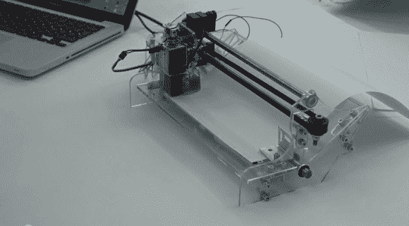

# 一种奇怪的打印机

> 原文：<https://hackaday.com/2013/12/19/a-weird-kind-of-printer/>

[本杰明]正在对他自制的纸钉针打印机进行最后的加工！？

从远处看，它就像普通喷墨打印机的骨架，但它不是。代替墨头的是一根针——有点像点阵(孔矩阵？)打印机。我们不得不承认，他用它来制作丝网掩模，这肯定非常方便——这肯定让焊接 SMT 不那么可怕了！它也可以用于压花，甚至盲文印刷。

打印机的框架由透明塑料激光切割而成，两个 Nema 17 步进器驱动 X 和 Y 轴。简单的螺线管致动器提供针刺动作。他使用 Arduino 来控制整个事情，并使用呼叫和响应协议将数据发送给它，以避免任何数据丢失。它的造价不到 200 美元，这是他最初的项目目标。

休息之后来看看吧！

[https://www.youtube.com/embed/Wvt8n5BqoFU?version=3&rel=1&showsearch=0&showinfo=1&iv_load_policy=1&fs=1&hl=en-US&autohide=2&wmode=transparent](https://www.youtube.com/embed/Wvt8n5BqoFU?version=3&rel=1&showsearch=0&showinfo=1&iv_load_policy=1&fs=1&hl=en-US&autohide=2&wmode=transparent)