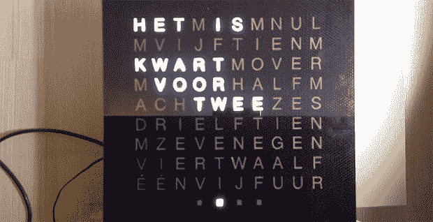

# Fubarino 竞赛:荷兰单词钟

> 原文：<https://hackaday.com/2013/12/20/fubarino-contest-a-dutch-word-clock/>

[Gerben]大约一年前开始了他在电子世界的冒险。他的第一个大项目是[这个宏伟的字钟](http://www.youtube.com/watch?v=bP_36V4GXsc)。如果你想知道的话，这是荷兰语。

作为一名网络开发人员，[Gerben]做的第一件事就是建立了一个基于网络的时钟模型。从那以后，他疯狂地用电动工具制作木架。也许太疯狂了，因为他忘记了电子产品的空间。这个疏忽是通过他自己制造多氯联苯解决的，首先使用过氧化物和醋，然后放弃并转向过氧化物和盐酸。

当时间是 13:37 时，这个单词时钟的复活节彩蛋是一个滚动的 URL。一个真正完全原创的聪明蛋。

从视频的外观来看，这个单词钟的安装和完成超出了我们以前见过的任何东西。时钟的整个正面是玻璃，四个 LED“分钟”显示屏旁边有电容式触摸按钮。

下面的视频，[这里的图片](http://gerben.algemeenbekend.nl/wordcloimg/)，所有的代码和板卡文件[都在这里](http://gerben.algemeenbekend.nl/wordclock/code/)。

* * *

这是 Fubarino 竞赛的参赛作品，有机会获得微芯片作为奖品提供的 20 块 [Fubarino SD 板中的一块。](http://www.microchip.com/stellent/idcplg?IdcService=SS_GET_PAGE&nodeId=1406&dDocName=en566210)

[https://www.youtube.com/embed/bP_36V4GXsc?version=3&rel=1&showsearch=0&showinfo=1&iv_load_policy=1&fs=1&hl=en-US&autohide=2&wmode=transparent](https://www.youtube.com/embed/bP_36V4GXsc?version=3&rel=1&showsearch=0&showinfo=1&iv_load_policy=1&fs=1&hl=en-US&autohide=2&wmode=transparent)