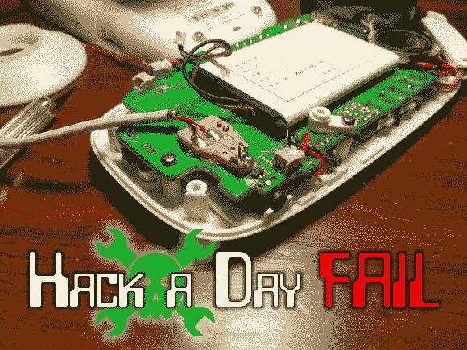

# 本周失败:婴儿监视器黑客在 Facepalm 结束

> 原文：<https://hackaday.com/2013/12/19/fail-of-the-week-baby-monitor-hack-ends-in-facepalm/>

编者按:这是我们储存的最后一个失败的一周提示。如果你想每周继续看到这个系列，我们需要帮助找到更多记录在案的失败！请回顾你的项目，记录那些不太顺利的项目。我们也鼓励你发送你发现的其他失败的链接。只需[在我们的提示行](mailto:tips@hackaday.com?Subject=[Fail of the Week])中删除链接。谢谢！

现在谈正事。这是一个婴儿监视器，[Eric]巧妙地修好了，但他意识到自己很可能是用了很大的力气才修好的。监视器坏了，一直没人用，直到他儿子想出怎么从婴儿床里爬出来，所以他觉得是时候重新开始监视了。他把设备从零件箱的边缘拉出来，着手修理损坏的电源连接器。

对电源适配器的进一步检查表明，它的规格是在 1A 输出 5V 电压。这符合 USB 电源，所以他剪下 USB-B 电缆的一端，用一大块原型板将 5V 线注入设备。当要重新组装外壳时，他将电路板翻转过来，发现了一个现有的 USB-B 端口。他可能只是在外壳上切一个洞，就可以接触到连接器，然后直接插入未改动的电缆。哦，好吧…我们相信找出他自己的定制解决方案是很有趣的！

* * *

** 每周失败是一个每周三运行的黑客专栏。通过写下你过去的失败和[给我们发送一个故事的链接](mailto:tips@hackaday.com?Subject=[Fail of the Week])，或者发送你在互联网旅行中发现的失败报道的链接，来帮助保持乐趣。**