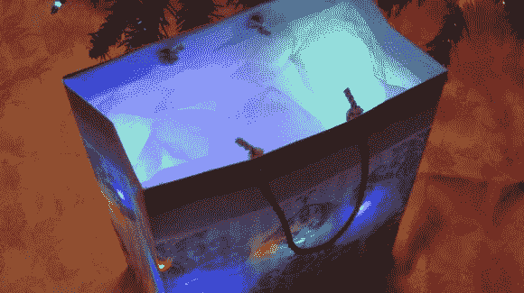

# 为你的礼物准备更多的灯

> 原文：<https://hackaday.com/2013/12/25/more-lights-for-your-presents/>

树上的灯？检查。圣诞树下的礼物？检查。礼物里的灯？为什么不呢！如果你的礼物看起来不够喜庆，而你家里有一个备用的感应充电系统——尽管如此，你总是可以[从头开始建造自己的](http://hackaday.com/2012/05/10/wireless-ipod-charger-built-from-scratch/)——你可以通过在包装中安装几个 led 来照亮事物。

Instructable 利用了那些新的 led 圣诞灯，其中一束通常在 1A 下工作，需要大约 5V，这使它与用于给手机充电的流行感应系统大致相当，如 [Powermat](http://www.powermat.com/) 。在这个特殊的例子中，strand 使用 3 节 AA 电池，即 4.5V，这意味着通过一个功率调节器或更方便的串联二极管来降低电压。

对包装的一些额外修改整理了安装，包括雕刻一些纸板以凹进接收器，并在用纸包裹之前用热熔胶固定所有东西。你可以在下面看到一个快速演示视频。

[https://www.youtube.com/embed/sQVtKKshKlI?version=3&rel=1&showsearch=0&showinfo=1&iv_load_policy=1&fs=1&hl=en-US&autohide=2&wmode=transparent](https://www.youtube.com/embed/sQVtKKshKlI?version=3&rel=1&showsearch=0&showinfo=1&iv_load_policy=1&fs=1&hl=en-US&autohide=2&wmode=transparent)