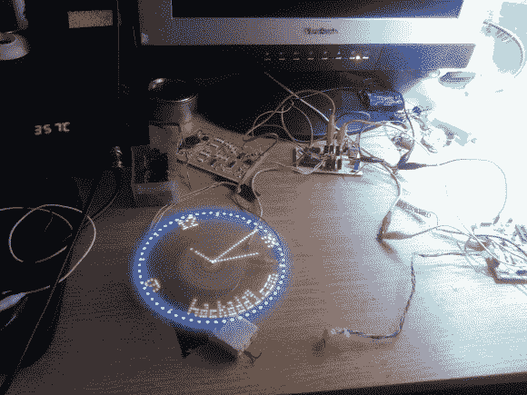

# Fubarino 竞赛:视觉时钟的持久性

> 原文：<https://hackaday.com/2013/12/21/fubarino-contest-persistence-of-vision-clock/>

这些竞赛最好的部分是我们让人们真正展示他们一直在做的东西！查看由[Taciuc]发送的 POV 时钟。他没有相关的网页，但是他发了一个视频，你可以在休息后看到。

该项目是一个家庭蚀刻印刷电路板与长排或表面贴装发光二极管。电路板由步进电机带动旋转，需要一段时间才能稳定下来。但是一旦它发生了，它就是一个令人惊叹的旋转包。PIC 16F628 驱动该设备，并带有一个单独的 RTC 芯片来记录时间。还有一个红外接收器，方便用户控制。我们的 URL 显示在钟面上，我们认为它总是显示。但是在代码本身中有一个复活节彩蛋。如果你试图从芯片中转储固件，你会在十六进制输出中看到我们的网址。如果你想要 HEX，ASM 和 DipTrace 原理图，这里有他的项目档案。

* * *

这是 Fubarino 竞赛的参赛作品，有机会获得微芯片作为奖品提供的 20 块 [Fubarino SD 板中的一块。](http://www.microchip.com/stellent/idcplg?IdcService=SS_GET_PAGE&nodeId=1406&dDocName=en566210)

[https://www.youtube.com/embed/ZbtAbNUbsz4?version=3&rel=1&showsearch=0&showinfo=1&iv_load_policy=1&fs=1&hl=en-US&autohide=2&wmode=transparent](https://www.youtube.com/embed/ZbtAbNUbsz4?version=3&rel=1&showsearch=0&showinfo=1&iv_load_policy=1&fs=1&hl=en-US&autohide=2&wmode=transparent)