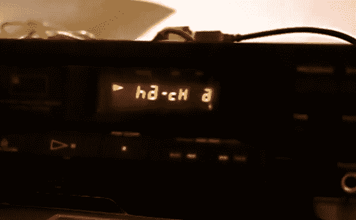

# Fubarino 竞赛:1980 年的 MPD CD 播放器

> 原文：<https://hackaday.com/2013/12/22/fubarino-contest-1980s-cd-player-with-mpd/>

[罗纳德]不得不抢着让他提交，但我们很高兴他这样做了。他的演示视频展示了一个 1980 年的 CD 播放器与音乐播放器守护进程的结合。真正起作用的只是原始显示器本身，但该项目尚未完成。然而，当曲目到达 22:00 标记时，它已经足够显示我们的 URL。

显示器由 ATmega32 芯片驱动，该芯片使用 USB 连接接收来自运行 MPD 的计算机的命令。[Ronald]不知道如何通过 USB 发送 int 值，所以他破解了自己的协议，只使用总线上每个字节的 LSB。休息之后，你可以看到视频，并阅读他提交的描述。还有[这里有一个代码包](http://hosted.hackaday.com/lcd-mpd.zip)。

* * *

这是 Fubarino 竞赛的参赛作品，有机会获得微芯片作为奖品提供的 20 块 [Fubarino SD 板中的一块。](http://www.microchip.com/stellent/idcplg?IdcService=SS_GET_PAGE&nodeId=1406&dDocName=en566210)

> 最终目标是在 20 世纪 80 年代的 CD 播放器盒子里有一个基于 MPD(音乐播放器守护程序)的播放器(工作)，使用原始的 LCD(工作)，能够使用原始的遥控器(工作)，能够播放 DVD(工作进行中)，诸如此类。
> 
> 我的计划是把原理图和源代码放在互联网上，并提交给的 [obdev.at](http://obdev.at/) ，因为我认为这是一种使用他们的 USB 驱动程序的新方法。因为我还在开发 pc 端的软件，所以我还没有做。我昨天才听说 Fubarino 竞赛，我认为修改我的项目是可行的，所以我做了。
> 首先，我忘了原理图。它们非常简单:这是一个普通的 Atmega32(没有 ATmega8，因为我主要使用我在下面打错的那些)HID Bootloader 加载设备。PORTD 的两个引脚用于驱动背板。五个 1.1K±1%电阻中有四个用作上拉/下拉电阻，以产生双背板 LCD 配置所需的 2.5V 电平。
> 
> 一点背景知识。为了驱动具有两个背板的普通 LCD，需要两个具有中间值的方波，以及用于分段的方波(例如图 2 中的[http://www.freescale.com/webapp/sps/site/overview.jsp?code=784_LPBB_LCDTIPS](http://www.freescale.com/webapp/sps/site/overview.jsp?code=784_LPBB_LCDTIPS) 。时序需要精确，以防止 LCD 段退化。任何足够大的 DC 偏移都可以杀死它…
> 
> PORTA、PORTB、PORTC 都连接到网段。PORTD 上的一个附加引脚连接到“播放”段(似乎是单个背板)，一个段连接到所有“关闭”段(我没有足够的引脚来驱动所有段)。
> 
> 因为我不知道如何使用 USB 发送 0x00 字符，所以我制定了自己的协议，将 2×3 数据字节的 LSBit 作为第四个数据字节的前三个发送，并在 ATmega 代码中解开这些字符。前三个数据字节的 LSB 均为“1”。
> 
> 在我的项目设计中，我决定在 pc 端完成大部分逻辑，并或多或少地使用 ATmega 作为帧缓冲器。这让我更难修改它来显示一些文本，并实现复活节彩蛋触发器。
> 为了显示文本(在这个 LCD 上不可能看到完整的[http://hackaday.com](http://hackaday.com)，所以我尽可能地接近:-))，我首先使用 pc 客户端生成字符的十六进制代码，然后将这些代码复制到 ATMega 源代码中，修改 LSB，直到它看起来很好。
> 
> 这就是我在截止日期前所能做的…我希望在代码中记录所有这些，但是啊，好吧..。对你来说理解就足够了。
> 
> 复活节彩蛋在 1 点 06 分的视频里。
> 
> 罗纳德，致以亲切的问候

[https://www.youtube.com/embed/k7IULfkiN5g?version=3&rel=1&showsearch=0&showinfo=1&iv_load_policy=1&fs=1&hl=en-US&autohide=2&wmode=transparent](https://www.youtube.com/embed/k7IULfkiN5g?version=3&rel=1&showsearch=0&showinfo=1&iv_load_policy=1&fs=1&hl=en-US&autohide=2&wmode=transparent)