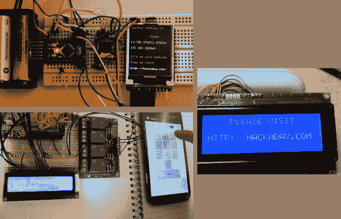

# Fubarino 竞赛:网络节点、门锁和吸烟者控制器

> 原文：<https://hackaday.com/2013/12/23/fubarino-contest-network-nodes-door-lock-and-smoker-controller/>

以下是三个不同的 Fubarino 竞赛参赛作品的综述；休息之后，将会有一段视频。

左上角是由[夏羽]开发的网络节点监控系统的雏形。当网络检查天气时，它可能会确定外面天气太恶劣，并且没有时间进去看看 Hackaday 上有什么新消息。关于硬件只有很少的信息。每个节点使用一个 ATtiny84 和一个 RFM12B——连接到每个节点的不同传感器用于构建网络的数据收集能力。

左下方是【布雷特的】[蓝牙门锁控制器](http://www.youtube.com/watch?v=vib2HNuLL8w)。Arduino，一种廉价的蓝牙模块，和一个中继板组成了基站，最终将连接到一个电子锁。[Brett]使用智能手机输入访问代码，连续四次输入“1337”解锁复活节彩蛋，在字符 LCD 上显示我们的 URL。这里是[他的项目](https://github.com/BertCC/LockProject)的代码库。

右边是用于烹饪的[Andy 的]吸烟控制器的显示屏。他已经在用于校准热电偶的控制器上隐藏了一些功能。为了比赛，他简单地添加了一个额外的按钮来扩展原来的菜单访问方法。

* * *

这是 Fubarino 竞赛的参赛作品，有机会获得微芯片作为奖品提供的 20 块 [Fubarino SD 板中的一块。](http://www.microchip.com/stellent/idcplg?IdcService=SS_GET_PAGE&nodeId=1406&dDocName=en566210)

网络节点:

[https://www.youtube.com/embed/g4ljtriqZKU?version=3&rel=1&showsearch=0&showinfo=1&iv_load_policy=1&fs=1&hl=en-US&autohide=2&wmode=transparent](https://www.youtube.com/embed/g4ljtriqZKU?version=3&rel=1&showsearch=0&showinfo=1&iv_load_policy=1&fs=1&hl=en-US&autohide=2&wmode=transparent)

门锁:

[https://www.youtube.com/embed/vib2HNuLL8w?version=3&rel=1&showsearch=0&showinfo=1&iv_load_policy=1&fs=1&hl=en-US&autohide=2&wmode=transparent](https://www.youtube.com/embed/vib2HNuLL8w?version=3&rel=1&showsearch=0&showinfo=1&iv_load_policy=1&fs=1&hl=en-US&autohide=2&wmode=transparent)

吸烟者控制器:

[https://player.vimeo.com/video/82050193](https://player.vimeo.com/video/82050193)