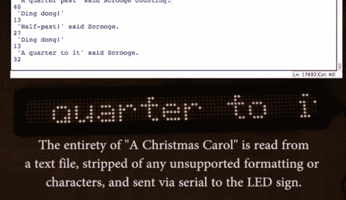

# 将狄更斯序列化为发光二极管

> 原文：<https://hackaday.com/2013/12/25/serializing-dickens-to-leds/>

[ch00f]通过将《圣诞颂歌》*全部翻译成滚动文本，成功捕捉了一些节日气氛。狄更斯的作品早已进入公共领域，这使得【ch00f】从亚马逊上订购了一台 GeekCatch 可编程显示器[。它的刷新率很低，这意味着视频看起来有点傻，但对于文本来说完全可以接受。[ch00f]抛弃了遥控器，转而使用显示器的串行连接在中篇小说中编程。不幸的是，他找不到任何关于串行协议的文档，但是他能够用网上找到的一些免费软件应用程序对其进行逆向工程。](http://www.amazon.com/gp/product/B0055PKD2U/ref=oh_details_o00_s00_i00?ie=UTF8&psc=1)*

这个标牌花了六个多小时才吐出完整的圣诞颂歌，这很容易就超过了显示器有限的文本缓冲区。[ch00f]不得不通过自定义 Python 脚本一次一段地将文本发送到显示器。这个解决方案利用标牌的固定宽度字体来估计每个字符滚动所需的时间，然后立即给标牌添加一个新行。

如果您决定在某个项目中使用这种显示器，请查看博客帖子，了解显示器本身的快速拆卸以及协议的详细描述。留下来看下面的视频吧！

[https://www.youtube.com/embed/X2KLnThDfNw?version=3&rel=1&showsearch=0&showinfo=1&iv_load_policy=1&fs=1&hl=en-US&autohide=2&wmode=transparent](https://www.youtube.com/embed/X2KLnThDfNw?version=3&rel=1&showsearch=0&showinfo=1&iv_load_policy=1&fs=1&hl=en-US&autohide=2&wmode=transparent)