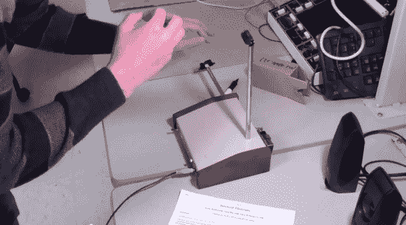

# 特雷门用四种声音说话

> 原文：<https://hackaday.com/2013/12/23/ir-theremin-speaks-in-four-voices/>

在每个学期结束的时候，我们都会从康奈尔大学的 ECE4760 班得到一堆很酷的、有据可查的学生项目。[Scott]和[Alex]的[红外线特雷门](http://people.ece.cornell.edu/land/courses/ece4760/FinalProjects/f2013/sjm298_ar568/sjm298_ar568/sjm298_ar568/index.html)也不例外。

经典的特雷门琴设计将演奏者的每只手作为 LC 电路中可变电容的接地板。对于俯仰天线，该电路是振荡器的一部分。对于体积天线，手动电容使另一个振荡器失谐，从而改变放大器的衰减。

[Scott]和[Alex]通过使用两个红外传感器来控制音量和音高，对特雷门琴进行了改造。传感器计算每只手的位置，并输出与手的距离成反比的电压。ATMega1284P 将信号转换为 8 位二进制数进行处理。他们内置了四种声音，可以通过按钮开关来控制。不同的声部是通过波形组合和调制效果创建的。除了经典的特雷门琴，您还可以在纯正弦、锯齿和 FM 调制中演奏。

如果你对微控制器没那么感兴趣，你可以制作这个数字红外遥控器。如果你发现他们没有灵魂或者很平庸，试试[这个 theremencello](http://hackaday.com/2013/04/03/building-a-theremincello/)。

[https://www.youtube.com/embed/FqG7rlj6tVM?version=3&rel=1&showsearch=0&showinfo=1&iv_load_policy=1&fs=1&hl=en-US&autohide=2&wmode=transparent](https://www.youtube.com/embed/FqG7rlj6tVM?version=3&rel=1&showsearch=0&showinfo=1&iv_load_policy=1&fs=1&hl=en-US&autohide=2&wmode=transparent)

[谢谢[布鲁斯](http://people.ece.cornell.edu/land/)