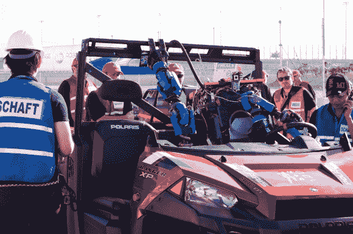

# DARPA 机器人挑战赛结束

> 原文：<https://hackaday.com/2013/12/22/darpa-robotics-challenge-trials-wrap-up/>

2013 年 DARPA 机器人挑战赛已经结束。最大的赢家是 Schaft 团队，如上图所示，他们正准备在车辆测试中驾驶。这并不是 DARPA 机器人挑战赛的终点——前方还有一场重大赛事。DARPA 机器人决赛将于 2014 年底举行。任务将与我们今天看到的类似，然而这一次团队和机器人的通信将被故意降级，以模拟真实世界的灾难情况。今天各队正在争夺 DARPA 的资助。前八名的每个团队都有资格从 DARPA 获得高达 100 万美元的资助。没有晋级的队伍仍然欢迎使用其他资金来源参加决赛。

试验分为 8 个项目。[门](http://www.youtube.com/watch?v=YQvEy3qTm8c)，[杂物](http://www.youtube.com/watch?v=iuysZlrINqU)，[阀门](http://www.youtube.com/watch?v=T5No8jgDp5E)，[墙壁](http://www.youtube.com/watch?v=ShtL12YQE7g)，[软管](http://www.youtube.com/watch?v=ICBAbYC9Ib8)，[地形](http://www.youtube.com/watch?v=_lEjCmFVhYA)，[梯子](http://www.youtube.com/watch?v=EMrSRcNIqIs)，以及[车辆](http://www.youtube.com/watch?v=3CjxZlhHiXA)。每个试验进一步分为 3 个部分，每个部分有一个点。如果机器人在没有人类干预的情况下完成了整个任务，它将获得一个加分。算上所有的奖金，一共 32 分。Schaft 队以令人难以置信的 27 分赢得了比赛。第二名是 IHMC 团队，得到 20 分。IMHC 团队值得特别表扬，因为他们使用了 DARPA 提供的机器人。使用 Atlas 的团队只有短短的几周时间从完全的软件模拟到与真实世界的机器人互动。第三名是卡耐基·梅隆大学的“格子呢营救队”T21 和他们的黑猩猩机器人，得了 18 分。

挑战的博览会部分也令人兴奋，第一反应者和机器人研究人员一起工作，以了解机器人在真实世界灾难情况下将面临的问题。谷歌最近收购的 Boston Dynamics 也在现场，运行他们的[野猫](http://hackaday.com/2013/10/05/boston-dynamics-takes-wildcat-outside/)和 [LS3](http://www.youtube.com/watch?v=R7ezXBEBE6U) 机器人。竞赛唯一真正的缺点是 DARPA 提供的覆盖面。现场直播还有很多不尽人意的地方。 [DARPA 的 YouTube 频道](http://www.youtube.com/user/DARPAtv/videos)上的大多数视频目前由一些活动摄像机的 9-10 小时记录组成。总结视频也很少包含机器人在试验中实际表现的信息。希望随着时间的推移，会有更多的信息和视频出现。现在，请在评论中分享你最喜欢的部分的时间戳和描述。

[https://www.youtube.com/embed/jeAboVErowE?version=3&rel=1&showsearch=0&showinfo=1&iv_load_policy=1&fs=1&hl=en-US&autohide=2&wmode=transparent](https://www.youtube.com/embed/jeAboVErowE?version=3&rel=1&showsearch=0&showinfo=1&iv_load_policy=1&fs=1&hl=en-US&autohide=2&wmode=transparent)