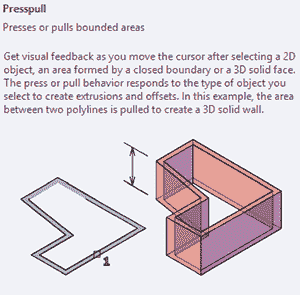
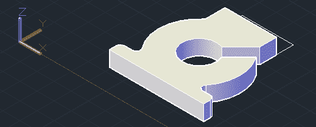
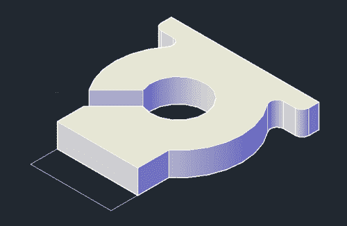
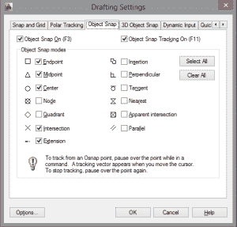
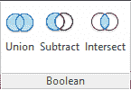
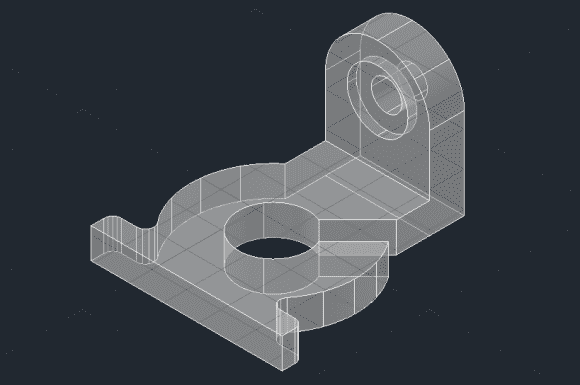

# 3D 打印:在 AutoCAD 中制作一个东西，第二部分

> 原文：<https://hackaday.com/2013/12/22/3d-printering-making-a-thing-in-autocad-part-ii/>

又到了 3D 打印系列*制作一件东西的时候了。上周有一个简短的教程，是关于在 AutoCAD 中制作一个*东西*的入门。这是一个极其复杂的软件包，为了让事情变得简单明了，我把这个 AutoCAD 教程分成了两部分。*

因为我们已经讲述了 AutoCAD 的 2D 设计部分，本教程的第二部分将把我们的 2D 部分变成一个三维物体。查看以下教程的其余部分。

#### 我们的事

就像所有这些*制作一个东西*的教程一样，我们正在使用这个从一本有近 100 年历史的绘图教科书中提取的物体。在之前的 AutoCAD 教程中，我们已经有了这部分的 2D 投影，所以让我们开始吧。

#### 视图和按拉

在本 AutoCAD 教程的最后一部分[中，我们只使用了“顶部”投影。如果你在 2D 工作，这很好，但是制作一个 3D 物体几乎是不可能的。我们需要做的第一件事是在 AutoCAD 中更改为等轴测投影。为此，只需点击“视图”选项卡，将视图更改为东南等轴测视图。你会得到看起来像左边图片的东西。](http://hackaday.com/2013/12/18/3d-printering-making-a-thing-with-autocad/)

在能够看到 Z 轴排序后，第一个任务是制作一个 3D 的 2D 物体。你可能认为这里我们要用的命令是 *挤压。* 不过，你就大错特错了。我们要用的命令叫做 *presspull。*

*Extrude* 是一个 AutoCAD 命令，通过 Z 轴拉动高亮显示的对象(在我们的例子中，是组成零件的线)。不过，它不会让你的线条变得坚实，所以除非你设计的是在 RepRap 上打印的单一厚度的花瓶，否则*挤压没有多大用处。*

通过从 AutoCAD 的“实体”菜单中选择 *presspull* 命令，我们可以点击我们想要拉进 Z 轴的对象，并使它们成为实体。如果你按照这个教程复制所有这些步骤，突出显示我们的“东西”的主要部分，键入*按拉，*并键入你想拉它到的高度。在我们的例子中，我们希望我们的“东西”的这一部分是 7/16”厚，或十进制英寸的 0.4375。

#### 编辑实体

你会注意到我们的“东西”缺少了什么——顶部有钻孔的法兰。不用担心，因为通过摆弄*盒子*和*圆柱体*固体，我们可以添加那部分。这是我们的过程动画。gif 格式，并附有如何操作的文字描述。

切换到东北等轴测视图。从主页选项卡中，选择*框。这是一个允许我们在三维空间中绘制一个盒子的工具，通过选择 X 和 Y 轴上的两个点，并通过 Z 轴向上挤压它。*

根据我们正在绘制的 100 年前的图纸，我们盒子的顶部应该是 7/16 英寸高的底部，然后再是 7/8 英寸高，以达到我们将要放置的圆柱体的中点。加起来是 1.3125 十进制英寸，所以单击 2D 框的一角，单击对角，然后键入 1.3125。

现在我们面临一点挑战。我们需要在我们的部分加上“圆顶”。使用*圆柱体*工具很容易做到这一点，但是我们需要确保它对准我们刚刚制作的盒子边缘的中心。如果你按照本教程学习，你已经体验了一些“捕捉”效果，但还没有达到中点。

*OSNAP。是的，你想要输入的命令叫做 *osnap。*顺便说一下，在第一周的制图课之后，这个笑话就变得非常非常老套了。*

Osnap 支持不同的捕捉方式，允许你从中点、端点和中心画点东西。默认情况下，不选择中点。点击复选框，然后点击 OK。画出你的圆柱体，然后从*实体*选项卡，点击联合，选择盒子和圆柱体，点击回车。

我们快结束了。剩下要做的就是我们刚刚创建的穿过这个法兰的钻孔和埋头孔。首先，我们将研究直径为 7/16 英寸的钻头。不是半径，是直径。

使用你新发现的 *osnap* 技能，画一个直径为 0.21875 十进制英寸的圆柱体。拉通过我们的法兰和*减去*，就像我们*联合*上述的盒子和圆筒。沉孔留给读者作为练习，因为它是完全相同的过程。

#### 包装东西

因为我们的目标是为 3D 打印机设计一个零件，所以我们需要制作一个 STL 文件。这是通过*导出*命令完成的。这是一个简单的过程，但是有一个问题:在保存之前，您必须选择一个部件中的所有对象。现在，我们的“东西”由两部分组成——有一个槽的奇怪的圆形东西，和有一个洞和埋头孔的圆顶东西。我们可以一起出口这两部分，但这是相当不雅的。选择 Union，单击两个部分，然后按 enter 键。然后导出到. STL。

你看看那个。我们做了一个东西。你也是刚学 AutoCAD，键盘上的 Escape 键在哭。

与之前的[用 OpenSCAD](http://hackaday.com/2013/12/11/3d-printering-making-a-thing-with-openscad/) 做东西的教程相比，用 AutoCAD 设计一个 3D 可打印对象并没有更难，只是不同而已。下周，圣诞节后的某个时候，我们将检查更多的 3D 设计软件，并再次制作我们的“东西”。如果你对我应该用什么软件有任何建议，请在评论中留言。我丢失了装有我打算使用的所有软件的便利贴。