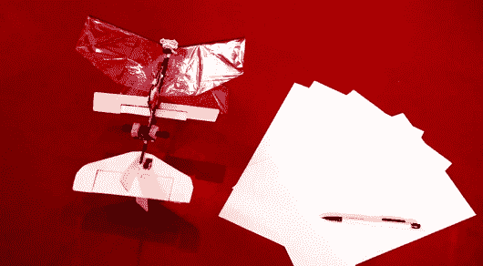

# 世界上第一架自主扑翼微型飞行器

> 原文：<https://hackaday.com/2013/12/23/the-worlds-first-autonomous-flapping-mav/>

[费迪南德]发了一个关于非常酷的 [DelFly Explorer](http://www.gizmag.com/delfly-explorer-flapping-wing-autonomous-mav/30167/) 的提示，它是由荷兰代尔夫特理工大学的研究人员建造的，据称是世界上第一个自主的扑翼微型飞行器。虽然它不像典型的扑翼机那样飞行，但它的规格会让你不在乎。它的翼展为 28 厘米，重量为 20 克，包括电机、电池、两个摄像头和自动驾驶仪。自动驾驶仪使用加速度计和陀螺仪，加上气压计进行高度测量。你可以在视频上的 35 秒标记处(休息后)看到机上视频。它们是令人难以置信的噪声图像，但显然研究人员已经提出了一些可以理解它的算法。

把所有这些放在一起，你就有了一个可以起飞、保持高度、避开障碍物、飞行九分钟的机器。在之前，我们已经看到了[一个很酷的扑翼机设计，甚至](http://hackaday.com/2013/08/21/amazing-flight-of-a-3d-printed-rubber-band-powered-ornithopter/)[一个推力矢量飞机](http://hackaday.com/2013/11/15/collective-pitch-thrust-vectoring-on-a-rc-plane/)，但这超越了两个项目。他们能把什么装进这么小的设计中，真是令人难以置信。

[https://www.youtube.com/embed/tNPfD9l14Js?version=3&rel=1&showsearch=0&showinfo=1&iv_load_policy=1&fs=1&hl=en-US&autohide=2&wmode=transparent](https://www.youtube.com/embed/tNPfD9l14Js?version=3&rel=1&showsearch=0&showinfo=1&iv_load_policy=1&fs=1&hl=en-US&autohide=2&wmode=transparent)