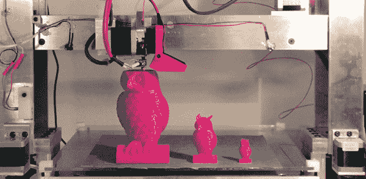

# 3DMonstr 打印机:8 立方英尺的构建体积

> 原文：<https://hackaday.com/2013/12/24/3dmonstr-printer-8-cubic-feet-of-build-volume/>

所以你在看 3D 打印机，但当前产品的生产量并没有达到你的预期。[Ben Reylblat]也遇到了同样的问题[，他发明了 3DMonstr](http://www.kickstarter.com/projects/breytblat/3dmonstr-large-industrial-grade-quad-extruder-3d-p) ，这是一台巨大的打印机，它(在其最大配置中)有两英尺的体积，四个挤压机，以及使一切工作的机械设计。

我们见过的大多数巨型 3D 打印机基本上都是普通桌面型的升级版。这个巨大的 [Ultimaker 副本](http://hackaday.com/2012/09/30/ginormous-ultimaker-can-print-slightly-smaller-ultimakers/)使用与其较小的表亲相同的杆，而 [LeBigRap](http://reprap.org/wiki/LeBigRep) 也使用小得可怜的部件。3DMonstr 不是小型机器的复制品，而是为每个轴使用非常大的电机、滚珠丝杠和适当的焊接框架。很可能没有人会把这台打印机称为摇摆机器人。

3DMonstr 有三种尺寸:12 英寸立方体、18 英寸立方体和 24 英寸立方体，有两到四台挤出机可供选择。我们在纽约 Maker Faire 上见到了 3D Monstr 团队，从第一印象来看，我们不得不说这台打印机非常巨大，设计完美。