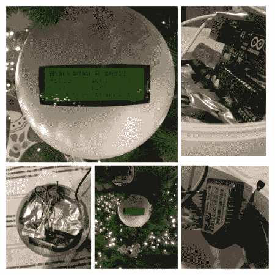

# 圣诞推特球

> 原文：<https://hackaday.com/2014/01/09/christmas-tweetball/>

假期早就结束了，但我们仍然得到了一些假日主题的黑客。为了这个，[韩]一家决定做一个[圣诞小玩意，把他们的推文转发给他们！](http://www.instructables.com/id/The-Tweetball-A-Christmas-Ornament-Ball-that-shows/)

他们称之为 Tweetbal，在荷兰语中是 Tweetball 的意思。每当有人用标签 [#tweetbal](https://twitter.com/search?q=%23Tweetbal&src=typd) 发推文时，它就会显示在 20×4 串行 LCD 显示屏上。他们使用带有 RN-XV wifi 模块的 Arduino Uno 来接收和发送推文到显示器上。一个巨大的白色塑料装饰球将它们包裹起来，并用我们最喜欢的粘合方法——管道胶带将它们牢牢固定。这是一个非常简单的项目，但如果我们自己这么说的话，这是一个非常棒的假日黑客——而且它可以很容易地用于非假日目的——就像一个桌面小饰品 twitter feed！

休息后留下来看看它的推特功能。

> [在 Instagram 上查看此贴](https://www.instagram.com/p/iTkCBMR9ct/?utm_source=ig_embed&utm_campaign=loading)[汉斯 克霍夫(@汉斯 克霍夫)分享的帖子 T51](https://www.instagram.com/p/iTkCBMR9ct/?utm_source=ig_embed&utm_campaign=loading)

