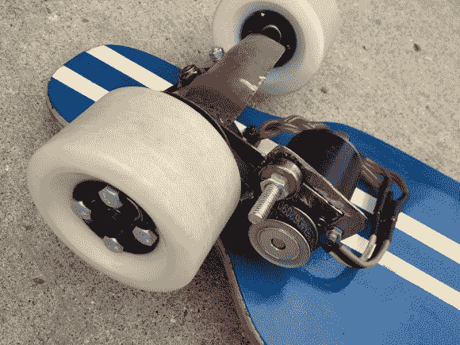

# 电动长板

> 原文：<https://hackaday.com/2013/12/27/motorized-longboard/>

你在高三的时候在做什么？嗯，他为[亚伦·科菲尔德]做了一个电动长板。

他从一个他喜欢的设计的普通长板开始，给它涂上一层漂亮的油漆(审美高于功能！)然后开始研究将它机动化。事实上，有一个非常方便的博客致力于将长板转换成电动的。经过数小时[的研究](http://afchacks.wordpress.com/2013/05/27/list-of-electronics/)，他选定了一个 2400W 钢筋混凝土螺旋桨发动机和一个 150A 高性能钢筋混凝土汽车电子稳定控制单元。谁知道就这么简单！

几个金属支架，一些皮带，链轮，一个惰轮和一整吨的锂离子电池之后，构建就完成了！他目前用遥控汽车遥控器控制它，但计划用 Wii 双截棍和 Arduino 控制它。今年夏天的测试让滑板的速度达到了每小时 20 英里！

它现在看起来已经完成了，但我们确信他将在明年夏天继续完善它——休息后留下来看看它的第一次试驾！

[https://www.youtube.com/embed/NgY_Cnvv3dw?version=3&rel=1&showsearch=0&showinfo=1&iv_load_policy=1&fs=1&hl=en-US&autohide=2&wmode=transparent](https://www.youtube.com/embed/NgY_Cnvv3dw?version=3&rel=1&showsearch=0&showinfo=1&iv_load_policy=1&fs=1&hl=en-US&autohide=2&wmode=transparent)