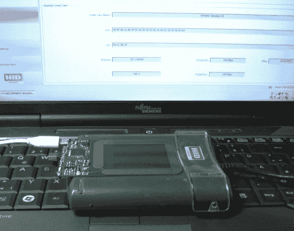

# 变色龙模仿非接触式智能卡

> 原文：<https://hackaday.com/2013/12/28/chameleon-emulates-contactless-smart-cards/>

德国波鸿鲁尔大学的研究人员很长一段时间以来一直忙于研究 RFID 和相关设备。他们称他们的劳动成果为[变色龙，一种多功能的非接触式智能卡模拟器](https://github.com/skuep/ChameleonMini/wiki)。[非接触式智能卡](http://en.wikipedia.org/wiki/Contactless_smart_card)是 RFID 类型的设备，也包含智能卡类型的存储器。这些卡通常用于支付，取代磁条式信用卡。飞利浦 MIFARE Classic 卡是非接触式智能卡的常见示例。变色龙被设置为使用 13.56MHz 的普通频带模拟任意数量的卡。添加新卡就像在固件中加载新的编解码器和应用程序一样简单。目前，变色龙可以模仿 MIFARE 卡使用。

变色龙是完全开源的，它的造价大约为 25 美元。系统的核心是 Atmel ATxmega192A3 微控制器。192 是完成这一任务的绝佳微控制器，因为它包含针对 DES 和 AES-128 的硬件加速器。FTDI USB 接口芯片用于在主机和 ATxmega 之间提供可选的通信链路。该链接可用于调试，以及实时操作数据。不过，主机并不是使用的必要条件——变色龙作为一个独立的单元也能很好地运行。我们肯定喜欢这个项目——尽管我们将加倍努力屏蔽我们的射频屏蔽钱包。