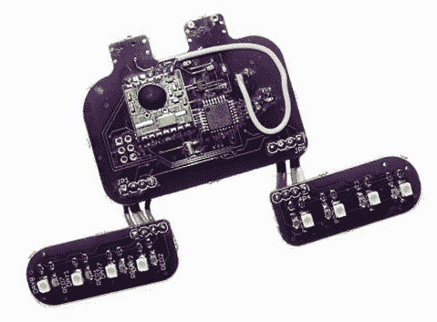

# 清醒计划需要你！

> 原文：<https://hackaday.com/2013/12/29/project-lucidity-wants-you/>

你做清醒梦吗？你想吗？【Dinesh Seemakurty】刚刚开始了一个叫做[项目清明](http://www.projectlucidity.com/)的东西，这是第一个(？)开源，开发者友好，功能齐全，清醒梦睡眠面膜。而且他在找黑客帮忙！

我们之前报道过很多关于清醒梦的项目，比如制作你自己自制的[清醒梦护目镜](http://hackaday.com/2012/04/19/do-anything-with-the-help-of-lucid-dreaming-goggles/)，或者[为清醒梦改装一个商用脑电图耳机](http://hackaday.com/2012/12/20/modifying-an-eeg-headset-for-lucid-dreaming/)。我们也不能忘记 LucidScribe 项目，也就是[寻求在梦境状态中交流的项目！](http://hackaday.com/2012/06/20/communicating-from-inside-your-dreams/)

不管怎样，清醒计划有什么不同？嗯，首先，它是开源的。其次，它基于 ATMEGA328P，这意味着它完全兼容 Arduino IDE。这看起来是一个很好的开始，而且[Dinesh]正计划很快将一切开源——但在此之前，他想让 **you** 尝试一下！

如果这听起来像是一个你想支持并帮助开发的项目，那就去看看他的网站并注册吧。或者在评论区问吧！