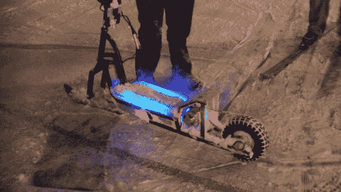

# 电动雪地滑板车

> 原文：<https://hackaday.com/2013/12/30/electric-snow-scooter/>

[Dane]决定他想做一个相当大的电动滑板车，能够带他穿越最恶劣的天气——没错，甚至是雪。

经过大约 18 个月的走走停停，它终于完成了——目前为止。它配备了一个令人印象深刻的 7kW 无刷三相电机，一个巨大的锂离子电池组和更多的定制零件，然后你可以摇一摇棍子！

该框架最初是 80 年代的一种大推滑板车，事实上，它与麦克摩尔旧货店视频中显示的一样！但从那以后，它已经做了许多修改——看起来好像前端是唯一没有被触及的部分！

他的网站有一个令人难以置信的建设日志，所以如果你想建立自己的网站(休息后你会看到视频)，这是一个很好的起点。

[https://player.vimeo.com/video/82257797](https://player.vimeo.com/video/82257797)