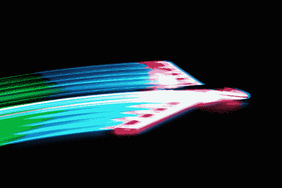

# UFO 外观的 RGB LED 遥控飞机点亮夜空，使用了所有的缩写

> 原文：<https://hackaday.com/2013/12/30/ufo-looking-rgb-led-rc-plane-lights-up-the-night-uses-all-the-acronyms/>

【roba loba】决定[将他对遥控飞机、会发光的东西和摄影](http://www.instructables.com/id/UFO-project-Color-Changing-Glowing-Radio-Controlle/)的热爱结合起来，我们很高兴他这么做了。他在这本说明书中分享了他的方法，为一架 Parkzone Stryker 遥控飞机照亮一个裸露的聚苯乙烯泡沫塑料[替换机身。那里还有更多令人惊叹的图片。](http://www.redrockethobbies.com/ParkZone-Bare-Fuselage-Unpainted-F27-B-C-Stryker-p/pkz1267.htm)

他使用低粘性胶带在机身上铺设 LED 灯条，焊接连接，并进行测试。一旦他对这种排列感到满意，他就把长条翻过来面朝下，这样泡沫就能漫射光线。这些灯由焊接在迪恩斯连接器上的 12V 锂电池供电。最后，[roba loba]用 [Doculam](http://www.pldaniels.com/flying/balsa/using-laminating-film-for-models.html) 覆盖并热封所有东西，这是一种非常划算的层压材料，提供了很好的保护和安全性。

他使用了一些 LED 玉米灯作为加力燃烧室，这是一种很好的现实主义。休息后有一个视频，在那里[roba loba]向我们展示了近距离的连接，然后通过一些灯光秀选项运行。另一个夜间飞行的视频正在等待你的报道。

今年花了太多的钱在蛋酒和一个新的主机上，以便能够复制这种构建？30 美元就能买到你需要的这个由智能手机控制的纸飞机。你总是可以迷惑它。

[https://www.youtube.com/embed/Ll64PzLlcLY?version=3&rel=1&showsearch=0&showinfo=1&iv_load_policy=1&fs=1&hl=en-US&autohide=2&wmode=transparent](https://www.youtube.com/embed/Ll64PzLlcLY?version=3&rel=1&showsearch=0&showinfo=1&iv_load_policy=1&fs=1&hl=en-US&autohide=2&wmode=transparent)