# 3D 打印:在搅拌机中制作东西，第一部分

> 原文：<https://hackaday.com/2014/01/03/3d-printering-making-a-thing-in-blender-part-i/>

如果你没有意识到，拥有一台 3D 打印机和拥有一台现实生活中的《星际迷航》复制器完全不同。首先，复制者通常出现在联邦星舰上，而不是宣传列车上。其次，在 24 世纪复制物体是如何设计的细节是一个 TNG 和 DS9 完全没有探索的问题，也只是几集《航海家号》中的一个小情节。然而，最有可能的是，复制的物体要么最初是通过用传送机“扫描”它们而产生的，要么是命令船上的计算机从全息网格中变出一些东西。

不，用你自己的 3D 打印机，如果你想要一个独特的物体，你实际上必须自己设计。没有全息甲板。用你的*手*移动*鼠标*和*键盘。*野人。

这一系列的“制作东西”教程旨在解决这个问题。在这篇文章中，我们来看看 [Blender](http://www.blender.org/) ，一个令人惊叹的 3D 建模和动画包。

因为我们还没有找到将多个博客帖子组合成一个单一资源的最佳方式——我们正在努力，不过——以下是之前“创造一个东西”帖子的链接:

*   [OpenSCAD](http://hackaday.com/2013/12/11/3d-printering-making-a-thing-with-openscad/)
*   [AutoCAD 第一部分](http://hackaday.com/2013/12/18/3d-printering-making-a-thing-with-autocad/)
*   [AutoCAD 第二部分](http://hackaday.com/2013/12/22/3d-printering-making-a-thing-in-autocad-part-ii/)

由于你对 3D 建模软件功能的建议，这个列表肯定会增加，但现在让我们在 Blender 中做一个东西。

#### 我们的事

[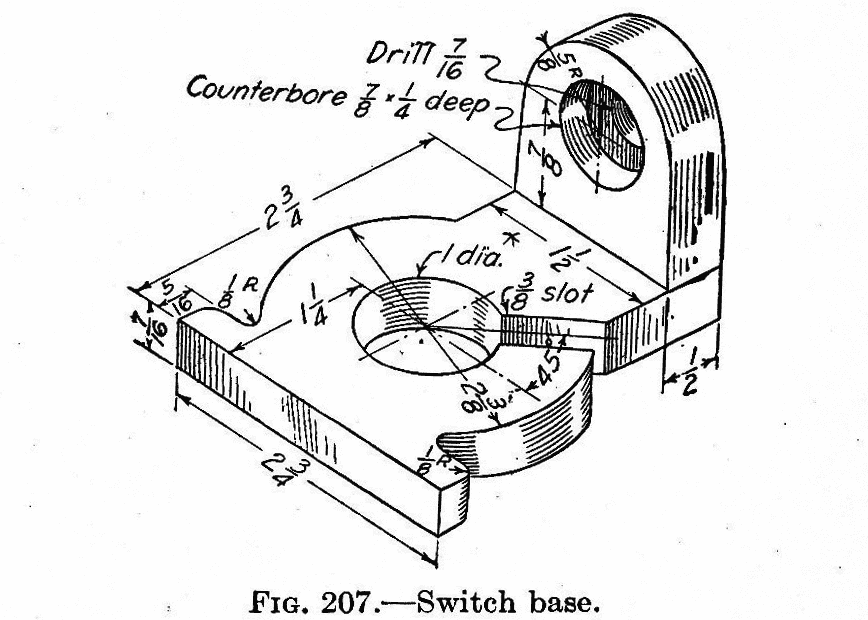](http://hackaday.com/wp-content/uploads/2013/12/engineeringdrawing.png)

右边是我们将在 Blender 中设计的部分。就像 OpenSCAD 和 AutoCAD 教程一样，我们使用的是同一个对象，这是一本 90 年前出版的关于制图的书里的一个奇怪的开关。你可以点击进入。

#### 关于搅拌机的一句话

Blender 被设计成一个 3D 动画套件。你知道旧的 90 年代中期皮克斯短片？你可以很容易地用搅拌机做出来。使用 Blender 设计一个小对象发送到 3D 打印机就像使用推土机建造一个沙堡。可以，但是大材小用了。

理想情况下，Blender 应该用于本质上不是机械的对象。如果你在为一辆遥控汽车设计变速箱，不要用搅拌机。如果你在做一个[安蒂基西拉机械装置](http://en.wikipedia.org/wiki/Antikythera_mechanism)的复制品，不要用搅拌机。然而，如果你正在设计一些更具雕塑感的东西，例如 Pietà，Blender 是一个很好的工具。

尽管 Blender 对于这个简单的零件来说有点大材小用，而且事实上 Blender 并不适合设计机械零件，很多人还是要求获得 Blender 教程。我有什么资格和黑客日的评论者争论呢？

#### 启动

安装搅拌机留给读者作为练习。在这里做那个。当你第一次启动 Blender 时，你会看到下面的屏幕，包括一个立方体，一个摄像头(金字塔形状的东西)，和灯。这是默认的开始屏幕，我们不需要这些对象。在右边的工具栏上，转到“场景”选项卡(在工具栏的顶部)，右键单击立方体、摄影机和灯，然后删除它们。

[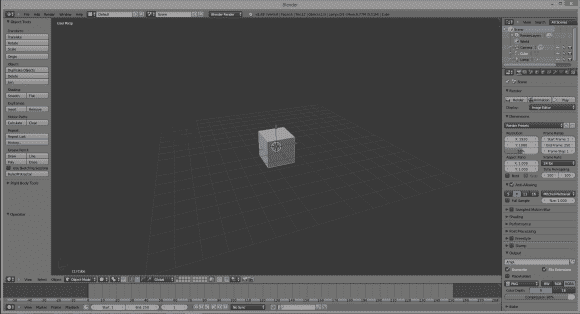](http://hackaday.com/wp-content/uploads/2014/01/1.png)

#### 网状物

现在我们有了一个空白的画布，我们可以开始设计我们的部分。由于本教程的这一部分已经完成了一半，我们将只设计我们的东西的“垫圈”部分-3/8”槽的圆。

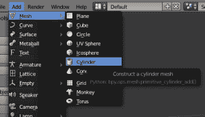

Blender 不像 OpenSCAD 和 AutoCAD 那样编辑实体，它做的事情完全不同。它使用*网格*、或顶点(3D 空间中的点)、边(两个顶点之间的线)和面(由边组成的多边形)的集合来定义一个对象。我们可以通过制作一个圆柱体网格来开始构建我们的东西。从顶部菜单栏中，选择添加->->圆柱体并点击左键。一个圆柱体将出现在场景中的坐标 0，0，0 处。

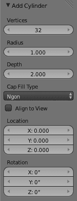

完成后，你会在左边的工具栏上看到一个“添加气缸”窗口。此窗口允许您编辑圆柱体的顶点数、半径和深度。现在是开始编辑我们的零件的好时机，所以将圆柱体的半径设为 1.1875(我们零件的 2 3/8″直径的一半)，深度设为 0.4375。

顺便说一句，是的，我现在开始后悔使用一本有 100 年历史的制图教科书中的一部分。

这是我们最终得到的结果:

[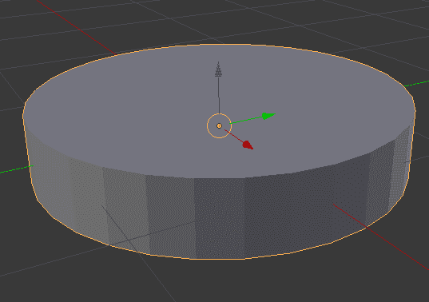](http://hackaday.com/wp-content/uploads/2014/01/new-cyl.png)

那是在搅拌机里做一个非常原始的物体。然而，为了让任何东西变得有用，我们需要进入*编辑*模式。

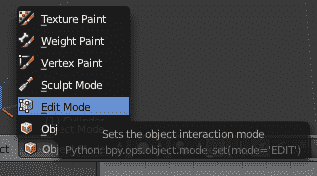

在 Blender 窗口的底部，你会发现一个菜单，它会改变你与 Blender 的交互方式。现在我们处于对象模式，这允许创建网格，表面，相机和灯。要编辑我们的对象，我们需要在…编辑模式。点击小下拉菜单，然后切换。这样做可以让我们编辑对象的所有顶点、边和面。这是我们刚刚创建的圆柱体，选择了所有这些:

[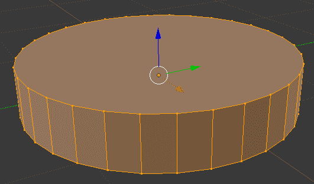](http://hackaday.com/wp-content/uploads/2014/01/edit-cyl.png)

按键盘上的“A”键取消所有选择。现在圆柱体是灰色的。

现在我们需要在这部分上打个洞。如果我们用实体建模，我们将简单地创建另一个圆柱体，比我们现在的小，并从我们当前的模型中减去它。不过，我们不是在研究固体。我们需要在没有布尔运算的情况下创建对象的面。

为了在这部分创建孔，选择圆柱体的顶面，用 ALT+F 组合键，用弹出的工具提示选择嵌入面。插入一个面允许我们为这个圆柱体创建一个新的顶部和底部，这将对应于我们需要的精确尺寸的孔。

[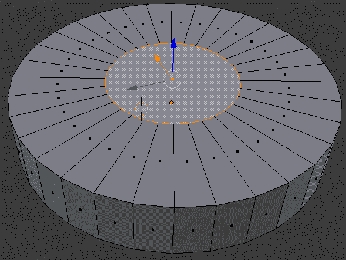](http://hackaday.com/wp-content/uploads/2014/01/hole-1.png)

[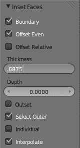](http://hackaday.com/wp-content/uploads/2014/01/inset-toolbar.png)

当您启用“嵌入面”命令时，您创建的洞的大小取决于您移动鼠标的距离；对于我们通过精确测量创造出来的东西来说，这可不太好。在左边的工具栏上，你可以输入我们想要的厚度。

如果你想知道的话，数学是这样的。我们零件的“圆柱体”直径为 2 3/8 英寸，我们希望在中间有一个直径为 1 英寸的孔。从 2.375 减去 1 英寸，得到 1.375。因为这个面的厚度实际上是一个半径，用 1.375 除以 2，你就会得到我们想要的数字。我真的讨厌十进制英寸。

删除洞的顶部后，在搅拌机中翻转该部分，对我们部分的另一个圆形面做同样的事情。你会得到这样的结果:

[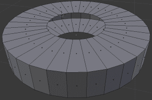](http://hackaday.com/wp-content/uploads/2014/01/hole-2.png)

现在我们需要做的就是把顶面和底面连接起来。

[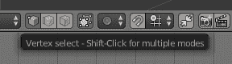](http://hackaday.com/wp-content/uploads/2014/01/vertex.png) 在你选择编辑模式的工具栏上，你会看到一组三个按钮。一个是顶点高亮显示的立方体，一个是选择了边的立方体，另一个是选择了面的立方体。知道这些按钮是做什么的吗？

我们将做一些更简单的事情，而不是分别选择零件内部的每条边并创建 36 个单独的面。按住 ALT 键，用鼠标右键选择其中一条内边。这将启用[边循环选择](http://wiki.blender.org/index.php/Doc:2.4/Manual/Modeling/Meshes/Selecting/Edges)。现在，在网格工具工具栏(左侧)，点击*挤压*并按下键盘上的“Z”键，将鼠标输入锁定在一个运动轴上。

[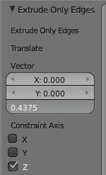](http://hackaday.com/wp-content/uploads/2014/01/extrude-edges.png)

同样在右边的工具栏上，你会看到三个标有“矢量”的方框。这是搅拌机将挤压我们的…X、Y 和 Z 轴上的挤出。我们希望在负 Z 方向上拉伸该边 7/16 英寸(或 0.4375 十进制英寸。这很简单。

[这是我们完成后得到的结果](http://hackaday.com/wp-content/uploads/2014/01/donut.png)。是的，我花了一千字来描述如何在搅拌机里创造一个洗衣机。

#### 你刚刚学到了什么？

至于在 Blender 中创建我们的“东西”,我们没有走多远。仍然有法兰，孔和圆做，但这只是这个搅拌机教程的第一部分。希望这是对 Blender 的网格和编辑这些网格的面和边的一个很好的介绍。

下周在这里再见！