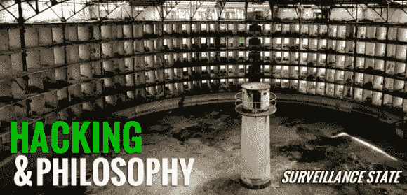

# 黑客和哲学:监视状态

> 原文：<https://hackaday.com/2013/12/30/hacking-and-philosophy-surveillance-state/>

如果你不生活在岩石下(尽管你现在可能想),你可能会看到昨天来自*明镜* [的一篇文章，这篇文章披露了美国国家安全局有自己的间谍设备目录。](http://www.spiegel.de/international/world/catalog-reveals-nsa-has-back-doors-for-numerous-devices-a-940994.html)今天他们发布了一个[互动图，上面有目录的内容](http://www.spiegel.de/international/world/a-941262.html "Electric Snow Scooter")，即使你不是黑客哲学&的经常读者，你也会想看一看。我建议浏览一下 IRATEMONK，在“计算机硬件”类别中。正如文章所解释的，IRATEMONK 是

> 一种隐藏在包括西部数据、希捷、迈拓和三星在内的制造商的硬盘驱动器固件中的植入物，它取代了主引导记录(MBR)。

目前还不清楚制造商是否串通在他们的硬件中植入 IRATEMONK，或者国家安全局是否刚刚开发了它来与这些驱动器配合工作。无论哪种方式，它都提出了一个重要的问题:我们如何知道我们可以信任硬件？简而言之，我们不能。根据图片附带的文字，美国国家安全局

> …[在目标计算机上安装]硬件单元，例如，在设备第一次交付给预定接收方时拦截设备，NSA 将这一过程称为“拦截”

我们很想听听你对此的回应:情况真的像看上去那么糟糕吗？你如何建立一个你知道你可以信任的系统？有没有其他方法可以更好地保证你不被监视？请继续阅读了解更多信息。

至于替代方案，我想提出[哈桑·埃拉希]提出的一个方案。你可能在电视上或者他的 TED 演讲中见过他。他向联邦调查局提供了大量关于他自己的数据。

他来我的大学做了一个讲座，讲述了他在监控状态下的经历，并提出了一些值得重复的有趣观点。首先，信息是一种商品，接触你的个人生活是有价值的。通过向这些机构提供大量个人数据，你实际上是在“淹没市场”。如果每个人都在这种程度上分享他们的数据，他认为监控状态跟不上(如果你没有看过[埃拉希的]谈话，它远远超出了脸书:他拍下他吃的每顿饭，他使用的每个厕所，每个酒店房间… [一切](http://elahi.umd.edu/track/))。

这是一个有趣的想法，如果我们真的正在成为一种分享的文化，这样的未来可能是不可避免的。也许有可能让网络空间充满信息，以至于我们的真实自我被淹没在噪音中，我同意一个人/个人的信息过载可能会描绘出一种非常奇怪的错误陈述——或者没有清晰的表述——这可能对你有利。对[埃拉希]来说，这是关于重新获得一种控制感，这是他肯定能做到的。在 TED 演讲的最后，他分享了自己的服务器日志，指出哪些政府机构访问了他的网站，以及何时访问的。也许这是一种控制的错觉，但[埃拉希]绝对是在创建和托管自己的档案，而不是怀疑政府是否在这么做。(他们很可能是)。

这里是我打破这种策略的地方:在我大学的演讲中，[埃拉希]似乎建议感兴趣的政府实体(国家安全局，联邦调查局等。)和人们一起整理这些数据，当面对铺天盖地的毫无意义的照片时，他们会放弃对你进行侧写。不过，这不是一个整理你的数据的人。这是一台机器，它不在乎外面有多少成千上万张照片:这是它用来对你做出假设的更多材料。他们的数据收集是自动的、全球性的，而且似乎是无限的。我怀疑他们会很乐意整合你提供的任何东西并存档以供参考。

让我们在评论中听到你们的回应:是不是没希望了？目录中的制造商列表是否影响了您未来的购买决策？