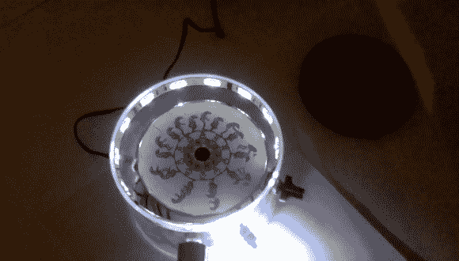

# 电子幻灯机！

> 原文：<https://hackaday.com/2014/01/01/electronic-phenakistoscope/>

寻找一种巧妙的方法来制作幻灯机？也许你更熟悉它的其他名字；幻灯机，幻灯机，或者它的近亲东方望远镜？

如果你还在挠头，没关系——它们的名字真的很奇怪。我们在这里指的是一种视错觉，它通过以偏移间隔显示一系列静止图像来模仿运动——这可以通过透过狭缝、频闪灯(就像在这种情况下)甚至通过使用镜子来实现。

这个特殊的 Phenakistoscope 是一个非常简单但聪明的设计，它利用了一台打印机的回收步进电机，一张 CD 作为动画光盘，一条 led 照明，几个电位计和一个 Arduino 来控制闪光灯。它的工作原理是使闪光灯频率与电机旋转同步，从而产生动态图像效果。

休息后留下来观看完整的构建画廊和演示视频。

[https://www.flickr.com//photos/65077062@N08/sets/72157639195664164/show/player/](https://www.flickr.com//photos/65077062@N08/sets/72157639195664164/show/player/)

当然，为了看到它的运行:

[https://player.vimeo.com/video/82955735](https://player.vimeo.com/video/82955735)

我们不久前还报道了一个很棒的 3D 打印的望远镜，它给动画带来了一点第三维的感觉！