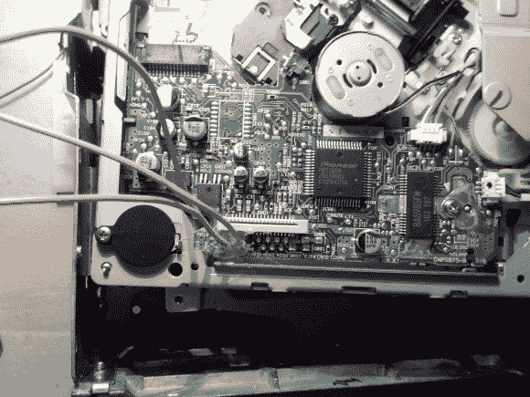

# 打开汽车音响

> 原文：<https://hackaday.com/2014/01/02/un-crapifying-a-car-stereo/>

[Noah Farrington]刚刚完成了他人生中的一个重要里程碑，购买了他的第一辆车！一辆光彩夺目的 2001 款福特福克斯旅行车。虽然它可能是一辆满载的豪华汽车，但它缺少了一件可怜的(诺亚)不能没有的东西。辅助输入端口。

他有几个改变局面的选择。接受现实吧，破解掉奇怪的福特媒体协议，或者骗过 CD 播放器播放他的输入。自然，他选择了第三种选择。

他面临的第一个挑战是拆除汽车的甲板。人们告诉他，他必须购买昂贵的立体声拆卸工具——他用帐篷挂钩和衣架凑合着用。使用与过去辅助输入黑客中描述的[相同的方法，他识别了 CD 播放器带状电缆上的音频输入引线。通过小心地焊接他自己的辅助插头，他几乎准备好了业务！不幸的是，CD 播放器也需要认为它是打开的，才能正确输出音频。[Noah]选择了简单的解决方案——录制一张无声 CD，永远留在卡片组中。](http://hackaday.com/2013/06/28/car-stereo-aux-input-taps-into-cd-ribbon-cable/)

休息后留下来看看它的运行。

[https://www.youtube.com/embed/-AJ5uNIVHnc?version=3&rel=1&showsearch=0&showinfo=1&iv_load_policy=1&fs=1&hl=en-US&autohide=2&wmode=transparent](https://www.youtube.com/embed/-AJ5uNIVHnc?version=3&rel=1&showsearch=0&showinfo=1&iv_load_policy=1&fs=1&hl=en-US&autohide=2&wmode=transparent)

他可能没有驾驶一辆经典的 1974 年步行者，但至少现在他可以在手机上听着数码灌制的波西米亚狂想曲尽情摇滚！