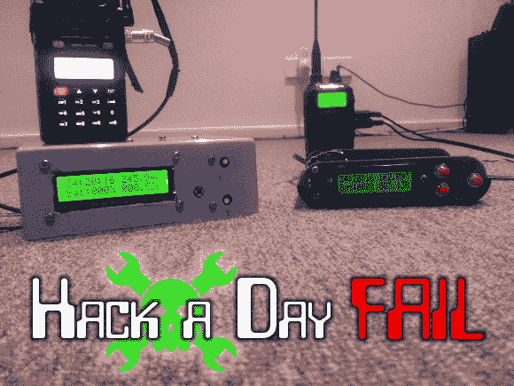

# 本周失败:AFSK 建筑被铁路噪音毁了

> 原文：<https://hackaday.com/2014/01/02/fail-of-the-week-afsk-build-doomed-by-rail-noise/>

[Scott]和他的伙伴们有一天正在玩他们的手持发射器，他们决定是时候建造一些可以发送和接收位置数据的附加硬件了。他们将目光投向了一套音频频移键控装置，每个装置都可以对对方的位置进行编码和解码。

该构建开始得很容易，以 Arduino 板为中心，带有 GPS 模块，用于捕捉精确的位置数据。接下来是实施 AFSK 的时候了。在发射端，这是通过对输出引脚进行位碰撞来实现的。在示波器上查看结果信号后，该团队能够将固件调整为非常紧密的 1200 和 2200 Hz 输出。但问题正在等式的解码端酝酿。

第一次解码尝试使用了[Paul Stoffregen]编写的 freq measure 库。在没有成功之后，他们转向了 XR-2211 FSK 解调器芯片形式的硬件解决方案。这应该很简单，给它输入信号并读取数字输出引脚，以捕捉所需的数据。此时，您需要点击顶部的项目链接来了解所有血淋淋的细节。长话短说，一个嘈杂的电源轨是造成这个芯片的零星性能。当这个问题被发现的时候，人们的兴趣已经减退，这个项目作为一个失败被放弃了。有没有什么快速解决办法可以挽救它，比如为芯片增加一个滤波电路？请在下面留下评论，让我们知道你将如何让这件事重回正轨。

[谢谢列文]

* * *

** 每周失败是一个每周三运行的黑客专栏。通过写下你过去的失败和[给我们发送一个故事的链接](mailto:tips@hackaday.com?Subject=[Fail of the Week])，或者发送你在互联网旅行中发现的失败报道的链接，来帮助保持乐趣。**