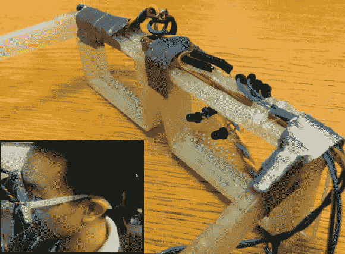

# 基于光电晶体管的眼球跟踪

> 原文：<https://hackaday.com/2014/01/03/phototransistor-based-eye-tracking/>

眼球追踪设备的应用是无止境的，这就是为什么我们总是兴奋地看到测量人眼绝对位置的新技术。康奈尔大学的学生[迈克尔和约翰]在他们的期末项目中采用了一种有趣的方法，设计了一种基于光电晶体管的眼球追踪系统。

我们可以肯定地看到这个项目的潜力，但对于他们的第一个原型，该系统依赖于眼睛跟踪和头部运动来完全控制鼠标指针。一个最终产品的设计正在酝酿中，因此该系统由一副定制的 3D 打印眼镜和一个无线接收器组成；从而避免了在控制下被束缚到计算机的需要。鼠标指针的水平位置通过红外眼睛跟踪装置控制，该装置由位于眼睛上方的红外 led 和位于眼睛两侧的两个光电晶体管组成。来自光电晶体管的测量模拟数据决定了眼睛的水平位置。鼠标指针的垂直移动由安装在眼镜上的三轴陀螺仪控制。简单的红外 LED/光电晶体管检测眼球运动的有效性令人印象深刻，因为我们见过的类似项目[都是基于摄像机的](http://hackaday.com/2013/02/12/build-an-eye-tracking-headset-for-90/)。我们理解最终项目的截止日期，所以我们希望[迈克尔和约翰]继续完成这个项目。如果能够用光电晶体管技术完全跟踪眼睛的绝对位置(水平和垂直)将会非常好。

[https://www.youtube.com/embed/1Zbyv8lTzhk?version=3&rel=1&showsearch=0&showinfo=1&iv_load_policy=1&fs=1&hl=en-US&autohide=2&wmode=transparent](https://www.youtube.com/embed/1Zbyv8lTzhk?version=3&rel=1&showsearch=0&showinfo=1&iv_load_policy=1&fs=1&hl=en-US&autohide=2&wmode=transparent)