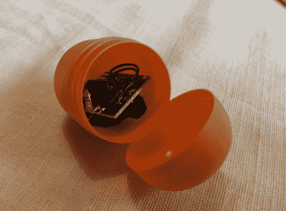

# 狗狗 DVR 报警传感器

> 原文：<https://hackaday.com/2014/01/06/doggy-dvr-alarm-sensor/>

[Martin]住在一个小村庄，离他在大城市的工作地点大约 25 公里。偶尔他家的警报系统会跳闸，他会冲回家，以确保一切都好。所以他决定买一个 DVR 系统……他把他的狗项圈变成了一个主要的传感器。

如你所知，DVR 除了装载摄像机外，还有传感器输入。这些可以很方便地告诉你小视频剪辑不会告诉你的其他事情，如水分，湿度，温度等。[Martin 的] DVR 有 8 个传感器输入，他将其配置为常开型传感器。通过使用夏普 817 光耦合器和[时髦的 v3 无线模块](http://harizanov.com/wiki/wiki-home/funky/)，他使其中一个传感器输入无线化。

在这个时髦的无线装置的另一端，他的狗项圈上有一个更友好的惊喜外壳。除了无线模块，它还包含一个基本的 2 轴震动传感器，由一个漂浮在金属针上的小弹簧组成——当剧烈移动时(当狗四处奔跑时),它会接触到,[马丁的] DVR 会通过电子邮件提醒他，并从系统中给他发送图片。

他怀疑自己会拍下很多照片，照片中的狗被路过的猫吓到了。