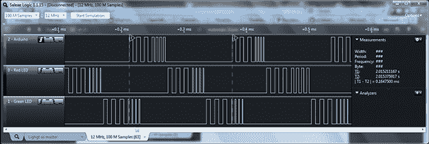

# 控制廉价的，令人敬畏的圣诞灯

> 原文：<https://hackaday.com/2014/01/07/controlling-cheap-awesome-christmas-lights/>

[James]圣诞节后在沃尔格林逛了逛，发现了一些非常有趣的东西——可单独寻址的 RGB LED 圣诞灯。一串 15 盏灯的价格是 6.5 美元，他只需要买几盏灯，并想出控制协议。毕竟谁能拒绝一个又大又便宜又可控的 RGB LED 灯条呢？

这些灯的包装——显然是由英国星公司制造的——包括一个“试试看”按钮，可以在不同的灯光模式之间循环。这个按钮最初让[詹姆斯]意识到这条线上的灯是可以单独控制的。打开其中一盏灯，他找到了他想要的东西:一团环氧树脂，两根电源线，三根信号线。

在用示波器和逻辑分析仪检查了这个灯之后，[詹姆斯]意识到有一个非常非常简单的协议在进行。本质上，整个字符串的功能就像一个巨大的移位寄存器，获取一个灯的值，并沿字符串向下移动。在查看协议时，[詹姆斯]还发现]这些灯支持 16 级亮度。是的，带脉宽调制的 RGB LED 圣诞灯售价不到 7 美元。没有比这更好的了。

[James]写了一个 Arduino 库来控制这些字符串，并把它放到了 Github 上。虽然你当地的沃尔格林可能已经把这些灯藏在了商店的后面，但问问周围的人看看他们是否还有剩余的灯可能是值得的。