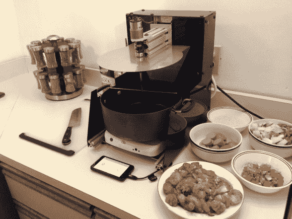

# 可编程烹饪机器人奥利弗

> 原文：<https://hackaday.com/2014/01/09/oliver-the-programmable-cooking-robot/>

[橡树机器人]正在对他们名为奥利弗的可编程烹饪机器人进行最后的润色。

它不会给你做蛋奶酥(但它从哪弄来的牛奶？)，但它确实旨在消除烹饪中令人厌烦的部分——即乏味的搅拌、调节温度和配料时间。虽然这确实使它明显不如原标题所暗示的那样令人印象深刻，但该团队有一个博客运行着[成功的食谱](http://oakrobotics.com/recipes/)——他们做出了一些美味的咖喱鸡、韩国牛肉，甚至[什锦饭！](http://oakrobotics.com/jambalaya/)

该团队目前正在寻找测试版测试人员，虽然我们不太确定这需要什么，但你肯定可以给他们发一封电子邮件并找到答案！想看奥利弗的厨艺展示，休息后留下来。

[https://www.youtube.com/embed/Lv86zCZHSp0?version=3&rel=1&showsearch=0&showinfo=1&iv_load_policy=1&fs=1&hl=en-US&autohide=2&wmode=transparent](https://www.youtube.com/embed/Lv86zCZHSp0?version=3&rel=1&showsearch=0&showinfo=1&iv_load_policy=1&fs=1&hl=en-US&autohide=2&wmode=transparent)

奥利弗很酷，但就个人而言，我们更喜欢[waffle meister 3000](http://hackaday.com/2011/02/24/der-wafflemeister-3000/)它可以在 3 分钟内一次烤 5 个华夫饼，高达 90Wfl/h！