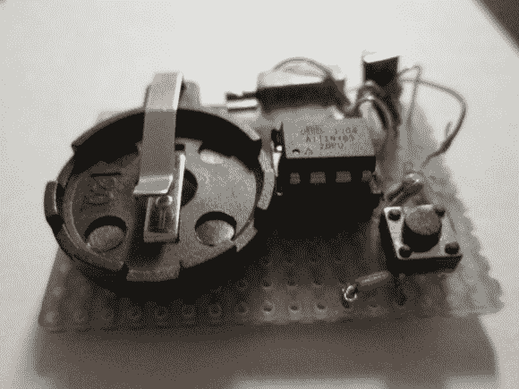

# 振动计时器

> 原文：<https://hackaday.com/2014/01/10/a-vibrating-timepiece/>

它看起来可能不怎么样，但上图中的设备是[qquuiinn 的]方便的小手表，它通过脉冲振动指示时间。也许我们应该避免给它贴上“手表”的标签，然而，考虑到 qquuiinn 的意图是消除实际观察事物的需要。振动以老爷钟的形式出现，每小时一次长振动，伴随着一刻钟增量的一次、两次或三次短脉冲。

设计很简单，用 ATTiny85 作为大脑，再加上一些模拟元件。振动电机用胶水粘在原型板上，连接微控制器、纽扣电池和小原型板上的按钮。该按钮允许手动时间请求；一个按键以振动的方式响应当前时间(大约，可能)。这是一项正在进行中的工作，并且[qquuiinn]承认缺少 RTC(实时时钟)会导致计时器的精度出现一些偏差。然而，我们怀疑，当你更换电池时，你会解决这个问题——每天两次——它只能持续十个小时。