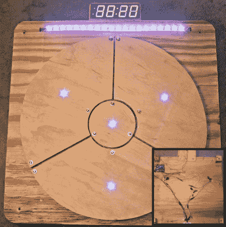

# Arduino 投球游戏

> 原文：<https://hackaday.com/2014/01/09/arduino-ball-throwing-game/>

建立自己的游戏平台本身就很酷，但是当游戏看起来很好玩时，那就是另一个层面的酷了。[Zippy314]设计了一个基于 Arduino 的游戏平台，作为给他儿子的圣诞礼物，名为 [Das 布林肯 Bonken！](http://www.instructables.com/id/Das-Blinken-Bonken-An-arduino-ball-throwing-game-p/)

像所有高度上瘾的游戏一样，游戏玩法很简单；玩家向目标板投掷一个球，同时瞄准特定的“pad”。正如休息后的视频所示，这个平台有许多游戏可能性，比如每次都试图击中被照亮的目标，或者只是试图尽快击中棋盘上的所有垫。

在自制压力传感器的帮助下，一个垫被记录为“击中”,每个压力传感器都由[压敏导电片构成。](http://www.adafruit.com/products/1361))这与[这些 LED 运动鞋](http://hackaday.com/2013/08/29/as-millenials-grow-up-do-they-demand-cooler-led-sneakers/)使用的材料相同。由于施加压力时，通过薄板的电阻会降低，因此使用一个简单的分压器电路来馈送 Arduino 上的模拟输入，从而使检测“点击”变得非常容易。I2C 4 位 7 段显示器记录分数并显示游戏标题，而一条可寻址的 RGB LEDs 给玩家反馈和其他重要的游戏信息。

[https://www.youtube.com/embed/UPtVqJkY8N8?version=3&rel=1&showsearch=0&showinfo=1&iv_load_policy=1&fs=1&hl=en-US&autohide=2&wmode=transparent](https://www.youtube.com/embed/UPtVqJkY8N8?version=3&rel=1&showsearch=0&showinfo=1&iv_load_policy=1&fs=1&hl=en-US&autohide=2&wmode=transparent)