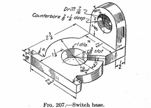
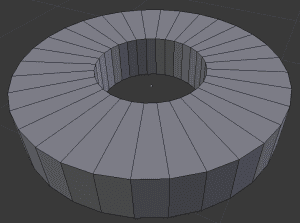
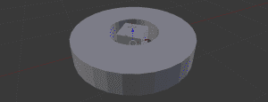
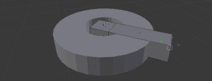
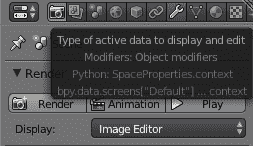
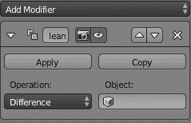
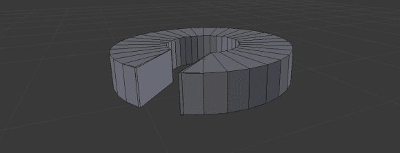
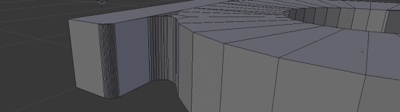
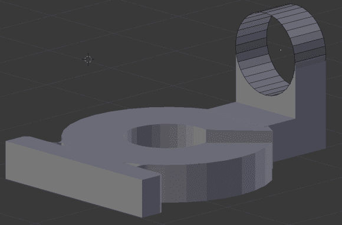
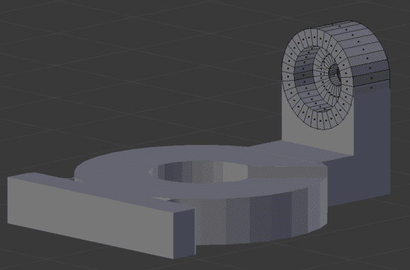

# 3D 打印:用搅拌机做东西，第二部分

> 原文：<https://hackaday.com/2014/01/08/3d-printering-making-a-thing-with-blender-part-ii/>

所以你有一台 3D 打印机，需要打印一些你自己设计的东西。如果你不知道如何创建和编辑 3D 对象，这是一个问题。在这篇文章中，我们[继续我们之前在 Blender](http://hackaday.com/2014/01/03/3d-printering-making-a-thing-in-blender-part-i/) 上的不幸遭遇，制作一个从一本关于制图的旧书上撕下来的“东西”。

之前，我们已经在其他 3D 设计包中制作了相同的零件。以下是其他“创造事物”帖子的链接:

*   [OpenSCAD](http://hackaday.com/2013/12/11/3d-printering-making-a-thing-with-openscad/)
*   [AutoCAD 第一部分](http://hackaday.com/2013/12/18/3d-printering-making-a-thing-with-autocad/)
*   [AutoCAD 第二部分](http://hackaday.com/2013/12/22/3d-printering-making-a-thing-in-autocad-part-ii/)
*   [搅拌机第一部分](http://hackaday.com/2014/01/03/3d-printering-making-a-thing-in-blender-part-i/)

我们已经完成了一半的工作，在搅拌机中制作一个“东西”，所以现在是时候完成这项工作了。查看以下教程的其余部分。

#### 我们的事

右边是我们为所有这些 3D 打印教程制作的“东西”。摘自第四版*工程图*(法文，1929 年，第 105 页)。是的，这是一幅 85 年前的带有分数英寸的画。不过，它服务于我们的目的:一个用 3D CAD 软件包制作东西的模板。

顺便说一下，如果有人有第一版的*工程图*，我很想看看这件物品是否真的可以追溯到 1911 年的那一卷。

#### 搅拌机的诅咒&到目前为止我们做了什么

在本教程的第一部分中，我说过使用 Blender 创建一个简单的机械物体，就像我们的“东西”一样，类似于使用推土机建造一个沙堡。我仍然坚持那个评估。*如果想制造精密的机械零件，就不要用搅拌机。* Blender 是制作有机和雕塑造型的工具。想打印出一棵塑料树？搅拌机是一个伟大的工具。想模仿一些希腊和罗马雕像吗？搅拌机是一个伟大的工具。需要一个机械装置的零件吗？不要用搅拌机。这不是这项工作的合适工具。

在本教程的第一部分，我们看了 Blender 背后的思想——网格编辑——以及如何与顶点、边和面交互来制作一个东西。随着所有介绍性的东西的方式，是时候完成这项工作了。

#### 一个东西的更多建筑

右边是我们离开本教程最后一部分的地方。它基本上只是一个垫圈，但尺寸对我们正在做的东西是正确的。在这件“事情”完成之前，我们需要做几件事情:

*   在此垫圈上添加 3/8”插槽
*   加上 2 3/4 英寸宽的法兰
*   添加 1 1/2 英寸宽的法兰
*   用埋头孔建造安装支架

不太坏，我们可以一点一点地做这些。

#### 添加 3/8 英寸插槽

 第一步是进入*对象*模式，在顶部菜单上用添加- >网格- >立方体创建一个立方体。使用右边工具栏上的旋转和缩放命令，手动设置立方体在 X 和 Y 轴上为 3/8 英寸，在 Z 轴上为 7/16 英寸。然后绕 Z 轴旋转 45 度。你应该得到类似左边图片的东西。

 使用*挤压*命令(热键‘E’)，拉动立方体的一个面穿过我们的垫圈/圆柱体。有多远并不重要，因为现在我们要做一些令人惊奇的事情:布尔运算。

此时，你的右上方工具栏中应该有两个对象:一个立方体和一个圆柱体。现在我们将使用修改器从圆柱体中减去立方体。

 点击上面的小扳手图标，选择添加修改器。选择 Boolean，你会看到类似右边的图片。

在 Blender 中，您可以执行布尔运算，如并集、减法和交集。然而，有一些限制。每个布尔运算只划分面和边，这意味着你需要在运算后手动删除所有无关的边。此外，减法运算不会把我们减去立方体后看到的缺失面放进去。

从我们的圆柱体中减去立方体。在删除了一大堆面和边，并创建了我们的 3/8”槽的“内部”之后，我们得到了类似这样的东西:

 它并不完美，但它确实存在。这个网上还有几个洞，但我们可以稍后修复它们。

#### 添加法兰

我们的东西有两个法兰来自我们刚刚制作的“带槽垫圈”。要创建 2 3/4”宽的法兰，在*对象*模式中添加一个立方体网格，并使用缩放(热键)和平移工具。左边的工具栏将允许你移动和缩放这个立方体，使之类似于我们“东西”上的大凸缘。之后，再做一次布尔运算(这次是“Union”)就很简单了，并做出如下所示的东西:

这看起来正好适合第一个法兰，但是我们在几个角上遗漏了半径。不过，这不是问题，因为[斜角工具](http://wiki.blender.org/index.php/Doc:2.6/Manual/Modeling/Meshes/Editing/Subdividing/Bevel)已经存在。

在编辑模式下，选择新凸缘的一个外角。按 CTRL-B，你就可以用鼠标设置斜面的半径，用滚轮设置斜面的分段数。不，你不能指定一个半径，这只是 Blender 在机械设计中很糟糕的一部分。

现在，挤出圆柱体的两个面(如果你没有注意到，我们已经完全放弃了尺寸精度)，并在新挤出的两个边上倒角。最后，您应该会看到如下所示的内容:

这足够接近我们的“东西”的正投影图。是的，网格上有洞，但我们可以稍后修复。

另一个凸缘容易以与第一个相同的方式构造。

#### 将圆顶和沉孔放入

我们要建造的最后一点“东西”是顶部有洞和埋头孔的奇怪的圆形部分。首先将我们的第二个法兰挤压到需要的量。接下来，在*对象*模式下创建一个圆柱体，并将两者进行布尔运算。删除圆柱体上的面后，您将得到如下结果:

还有一件事要做:在我们刚刚删除的面上打一个 7/16”的孔，并在那个孔上打一个 7/8”的沉孔。基本上，我们正在制作另一个圆环/垫圈类型的物体。查看这个搅拌机教程的第一部分以获得如何操作的指导。

完成第二个圆柱/沉孔，我们可以称之为部分完成。这是我们最后得到的结果:

不过，这并不是说这部分已经准备好投入打印机了:我们的网格中仍然有一些漏洞，这些漏洞会使任何切片程序崩溃。这可以用 [MeshLab](http://meshlab.sourceforge.net/) 修复，但那是另一个时间的教程。

#### 那已经结束了。

这就是你如何在搅拌机里做一个“东西”。虽然不好看，但你可以做到。我需要再次重申，搅拌机不是这项工作的合适工具。如果你正在制作放入视频游戏的物体，Blender 是一个很好的工具。如果你正在做一些可以被认为是数字雕塑的东西，Blender 是一个很好的工具。如果你用直线、空间部分和精确的角度来制作东西，你可以用一百个不同的 CAD 软件包中的一个做得更好。

* * *

关于下周的教程，是在 Solidworks 还是 Sketchup 之间进行选择。如果你有这样或那样的偏好(甚至是第三种选择)，请在评论中留言。