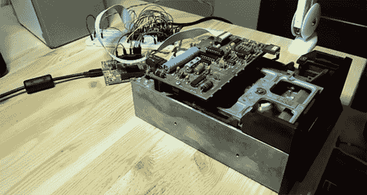

# 废弃磁盘格式的磁盘真空

> 原文：<https://hackaday.com/2014/01/10/a-diskvaccuum-for-obsolete-disk-formats/>

[Jim]有一箱非常旧的 Compucolor II 计算机的磁盘，随着位腐蚀慢慢出现，他认为是时候将所有这些磁盘转储为更永久的格式了。在回顾了现有的读取这些磁盘的工具后，[他决定构建自己的软盘接口](http://forum.gadgetfactory.net/index.php?/page/articles.html/_/papilio/diskvaccuum-project-r82)，他称之为 DiskVaccuum。

DiskVaccuum 基于一个 [Papilio Pro FPGA 板](http://papilio.cc/index.php?n=Papilio.PapilioPro)和几个相当于电平转换的芯片。FPGA 能够轻松地读取位和移动磁头，将所有内容保存到更现代的计算机驱动器中。

在 Papilio 板的 USB 端，[Jim]用 Python 写了一个外壳，可以捕捉磁盘上的曲目，读取曲目列表，保存图像文件，并做所有正常 DOS 应该做的事情。目前，该项目仅针对 Compucolor II 磁盘驱动器，但[Jim]充分利用 KiCAD 创建了一个 Papilio-to-disk-drive 接口板，该接口板带有用于这一特定年份的大多数磁盘驱动器的连接器。希望能够推广硬件和软件来读取其他系统的磁盘，包括那些 8 英寸驱动器的系统。

[Jim]上传一段视频，描述硬件并演示他的 Python 捕获实用程序。你可以看看下面。

[https://www.youtube.com/embed/u62Y0ndSLHk?version=3&rel=1&showsearch=0&showinfo=1&iv_load_policy=1&fs=1&hl=en-US&autohide=2&wmode=transparent](https://www.youtube.com/embed/u62Y0ndSLHk?version=3&rel=1&showsearch=0&showinfo=1&iv_load_policy=1&fs=1&hl=en-US&autohide=2&wmode=transparent)