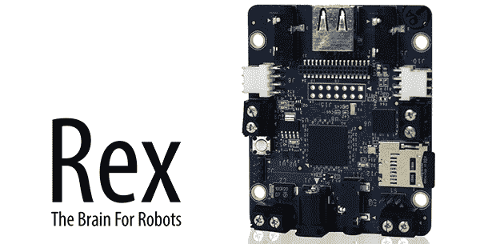

# 雷克斯，手臂驱动的机器人板

> 原文：<https://hackaday.com/2014/01/11/rex-the-arm-powered-robot-board/>

有一百万个教程可以用 Arduino 或 Raspberry Pi 来构建机器人，但它们都有相同的问题:duino 和 Raspi 都不是完全集成的解决方案，它们将所有硬件——电池连接器、I/O 端口和其他所有东西都放在同一个板上。这就是由手臂驱动的机器人控制器雷克斯解决的问题。

Rex 的规格包括 1GHz ARM Cortex-A8，带[视频 SoC](http://www.ti.com/lsds/ti/arm/arm_video_solutions/arm_cortex_a8_video/tms320dm37x_soc/products.page?paramCriteria=no) 和 DSP 内核，512 MB 内存，USB 主机端口，支持摄像头模块，以及 3.5 毫米立体声输入和输出插孔。最重要的是，有一个伺服适配器和 6-12 V 电池的输入和输出 I2C 扩展端口。基本上，Rex 类似于 Beaglebone Black，其硬件针对机器人控制系统进行了优化。

因为运送一个没有任何软件的 ARM 板会很无聊，Rex 背后的家伙想出了 [Alphalem OS](http://alphalem.com/pages/alphalem-os) ，这是一个 Linux 发行版，包括脚本、示例程序和用于与 I2C 设备交互的 API。当然，Rex 也将运行其他[机器人操作系统](http://www.ros.org/)和通常的 Debian/Ubuntu/Whathaveu 发行版。

这是一个令人印象深刻的硬件，能够进行语音识别，并使用 OpenCV 执行机器视觉任务。结合这一整套伺服系统，雷克斯很容易成为噩梦般的六足机器人的大脑，它会响应你的声音，跟着你在房间里走来走去。

你可以在 Kickstarter 上挑选一只 Rex [并在今年夏天的某个时候交货。](http://www.kickstarter.com/projects/alphalem/rex-the-brain-for-robots)