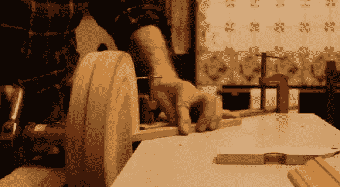

# 自行车动力打磨器

> 原文：<https://hackaday.com/2014/01/12/bicycle-powered-sander/>

[安迪]做了很多框架，需要一种方法在适当的角度打磨作品。他在 YouTube 上的昵称是[Organikmechanic],正因为如此，他试图越来越少地依赖电力——所以他用自行车的部件创造了这个手动打磨器。

他的第一次迭代只是使用了自行车车轮的主轴作为主轴，但他很快发现它对磨盘来说不够刚性。相反，他决定利用旧自行车的整个曲轴组件。他削减了框架的尺寸，拆除了一个踏板，并缩短了另一个更有用的手摇长度。自行车的主齿轮为他自制的打磨盘提供了一个大而坚固的安装表面，打磨盘由一大块圆形刨花板组成。

这是对回收零件的巧妙利用——但你怎么看？你有足够的环保倾向放弃你的电动工具吗？广告之后是该项目的完整视频解释。

[https://www.youtube.com/embed/BqpOLVZFzps?version=3&rel=1&showsearch=0&showinfo=1&iv_load_policy=1&fs=1&hl=en-US&autohide=2&wmode=transparent](https://www.youtube.com/embed/BqpOLVZFzps?version=3&rel=1&showsearch=0&showinfo=1&iv_load_policy=1&fs=1&hl=en-US&autohide=2&wmode=transparent)