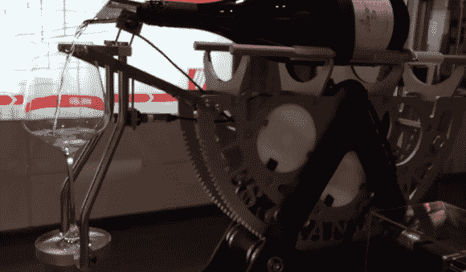

# 自动滗水机将葡萄酒与 Pi 配对

> 原文：<https://hackaday.com/2014/01/12/automated-decanting-machine-pairs-wine-with-pi/>

专注于流程、自动化和设施规划的德国软件公司【Logi.cals】设计了[一台自动化葡萄酒滗析机](http://www.logicals.com/products/logi.CAD_3/automateddecantingmachine/)来展示其逻辑。CAD 3 PLC 编程工具。[侍酒师](http://en.wikipedia.org/wiki/Sommelier)使用这些简单的机器来搬运沉重、昂贵的酒瓶。[Logi.cals]在一个非常漂亮的标本上添加了传感器和步进电机，并用树莓酱自动化了倾析过程。

这种设计的突出特点是内置冗余。一对微型开关检测瓶子和玻璃杯的存在。如果做不到这一点，称重传感器就会对瓶子进行称重，自然地报告瓶子是否存在。称重传感器也在监控瓶中的液位方面发挥作用，记录葡萄酒流量的电容传感器也是如此。该设计还包括测量玻璃重量和液位的应变仪。为了实现完整的循环，他们还要验证是否有玻璃杯。

[Logi.cals]使用了两个扩展板， [Quick2Wire 接口与 I C 模拟板](http://quick2wire.com/products/quick2wire-interface-board-kit/)和 [PiFace](http://www.piface.org.uk/) 。I C 模拟板通过其 ADC 从应变仪获取信息，Quick2Wire 通过串行连接与称重传感器的测量放大器通信。PiFace 处理剩余的传感器和步进电机，并为 Pi 提供高压保护。

如果你刚喝完又重又贵的葡萄酒，但身边有一些便宜的，你可以用 Pi 让它们跳舞。

[https://www.youtube.com/embed/snE1DnTyp8w?version=3&rel=1&showsearch=0&showinfo=1&iv_load_policy=1&fs=1&hl=en-US&autohide=2&wmode=transparent](https://www.youtube.com/embed/snE1DnTyp8w?version=3&rel=1&showsearch=0&showinfo=1&iv_load_policy=1&fs=1&hl=en-US&autohide=2&wmode=transparent)

[途径 [adafruit](http://www.adafruit.com/blog/2014/01/10/raspberry_pi-piday-raspberrypi-103/)