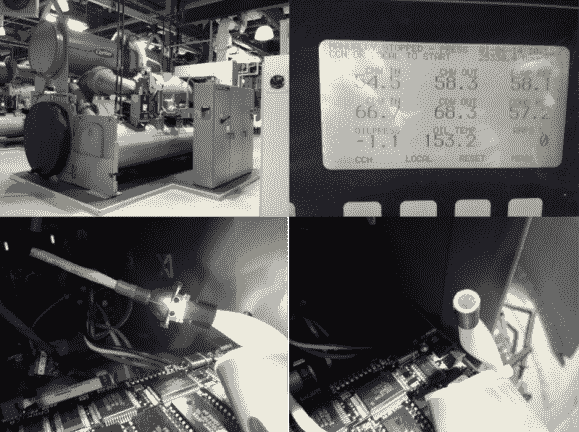

# 单个 LED 节省 20，000 美元

> 原文：<https://hackaday.com/2014/01/12/saving-20000-usd-with-a-single-led/>

【n8mc nasty】是一名 HVAC 技术人员，在一些大型机器上工作。他的一项费用是一台 [开利 19EX](http://imgur.com/a/IzqYi)制冷机，额定制冷 1350 吨。1 吨冷却= 12，000 BTU。这个特殊的冷却器包含一个奇怪的液晶显示屏。它使用光纤束和卤素灯作为背光照明。该系统运行良好超过十年。然而现在，卤素灯泡已经开始融化光纤束上的胶水，导致显示模糊。有问题的显示屏显示一些非常重要的操作参数，如油温、电流消耗和过程温度。由于他们不容易看到显示器，机器的操作员没有运行机器，这给大楼物理设备中的其他冷却器带来了压力。[N8Mcnasty]尝试修复捆绑，但是胶水一直在融化。

替换显示器不再可用，这意味着整个冷却器控制系统将不得不升级到更新的系统。新的控制系统使用了与旧系统不同的传感器。这就是东西开始变贵的地方。更换传感器还需要排放 15-20 加仑的油，4500 磅的 R134a 制冷剂，并使整个系统停机近两周，这是一项 20，000 美元的工作。[N8Mcnasty]没有走这条路，而是找到了另一条路。自 1996 年冷水机组建成以来，LED 已经走过了漫长的道路。他简单地用一个 LED 和适当的电阻代替了卤素灯泡。[N8Mcnasty]甚至能够重复使用卤素灯泡支架。一点热收缩管后，修复看起来像是一个工厂选项。他在 reddit 上记录了他的修复方法[。](http://www.reddit.com/r/techsupportmacgyver/comments/1ujl1w/upgraded_an_old_fiber_optic_display_from_halogen/)