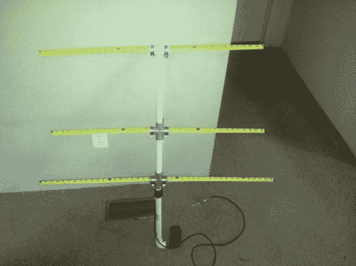

# 卷尺甚高频八木天线

> 原文：<https://hackaday.com/2014/01/13/tape-measure-vhf-yagi-antenna/>

无线电测向和猎狐非常有趣，是业余无线电爱好者的热门活动。这些天线非常棒，不仅有利于寻找发射机，还将大大提高定向距离性能，包括与卫星和国际空间站(ISS)的通信。

[jcoman]有一个侄子对学习业余无线电很感兴趣，所以[jcoman]认为建造和使用一个[便宜和便携的 2 米波段 VHF Yagi 风格波束天线](http://www.instructables.com/id/The-Tape-Measure-Antenna/)将是吸引这个年轻小伙子对这个爱好的兴趣的完美活动。

他的设计是基于[【乔·莱吉奥】(WB2HOL)的设计](http://theleggios.net/wb2hol/projects/rdf/tape_bm.htm)加上一些他自己计算的改动。我们以前见过 DIY 八木天线设计，但让这种结构如此有趣的是，这些元素是使用切割金属卷尺片段来组合的。这些卷尺允许通常是一个大而笨重的装置的八木天线容易地装载在车辆或背包中。当需要天线时，卷尺部分会自然展开，并以 7 dB 的方向增益运行良好，并且可以调整以在任何所需的 2 m 频率下获得 1:1 的 SWR。

另一个独特的特点是，如果你真的购买了这些材料，这种天线的造价不到 20 美元。如果你回收一个旧卷尺，花费会更少。你甚至可以把 PVC 管、软管夹和电线放在周围，让建筑变得几乎免费。

我们非常惊讶地发现，这种使用卷尺元素的流行天线构建方法还没有在 Hackaday 上出现。为了完整起见，这不是 Instructables 上唯一的 DIY 卷尺八木，因此也可以查看[FN64]2m 波段"[甚高频](http://www.instructables.com/id/Radio-Direction-Finding-Antenna-for-VHF/)无线电测向天线和[manuka]70cm 波段" [433 MHz 卷尺超高频天线](http://www.instructables.com/id/433-MHz-tape-measure-antenna-suits-UHF-transmitte/)帖子。Hackaday 上展示的其他八木天线设计是“[建造八木宇田天线](http://hackaday.com/2010/08/13/building-a-yagi-uda-antenna/)”和“[将复活节彩蛋狩猎变成狐狸狩猎](http://hackaday.com/2013/04/04/turning-an-easter-egg-hunt-into-a-fox-hunt/)”，但这些设计建造起来并不简单，也不便于携带。