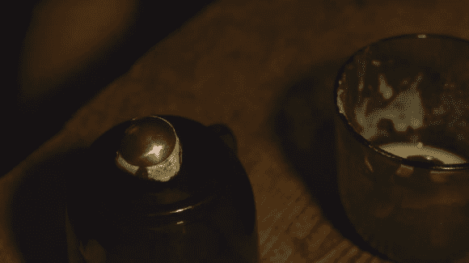

# 铜蚀刻:不仅仅是印刷电路板

> 原文：<https://hackaday.com/2014/01/13/copper-etching-not-just-for-pcbs/>

[莫拉格·希克曼]是一位艺术家，他利用氯化铁做其他事情，而不是蚀刻印刷电路板。她用这个过程在她的珠宝上蚀刻出美丽的图案。

[乌龟管家]是一个小摄制组，他们创作了这部关于蚀刻铜艺术的三分半钟的电影，观看它绝对是一种享受。没有电脑，没有墨粉转移，她甚至不在平面上蚀刻。这是做不同事情的一个很好的例子——为什么不添加蚀刻来结束一个项目呢？如果你已经做了 PCB，做一个 logo 也没那么难吧！

无论如何，自从我们分享手工制作的黑客已经有一段时间了，我们认为这是一个值得关注的好例子。别忘了把你自己的手工作品发到 tips 热线！

休息后留下来欣赏这部电影——我们建议全屏高清观看。

[https://player.vimeo.com/video/83871272](https://player.vimeo.com/video/83871272)