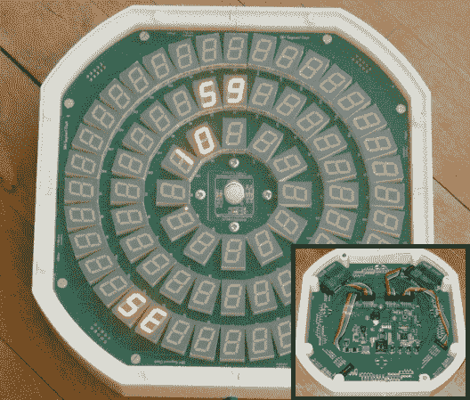

# 504 段时钟

> 原文：<https://hackaday.com/2014/01/14/504-segment-clock/>

试图重新发明时钟的尝试已经做了一遍又一遍，但看到这些设计变得如此过度和复杂总是很有趣。[Bertho]他家的最后一个工作时钟是录像机上的内置时钟，所以他决定终于是时候建造自己的 [504 分段时钟了。](http://www.vagrearg.org/content/504segclock)

对，没错，504 段！这个时钟使用 72 个 7 段显示器来显示时间。休息后的视频显示了时钟的运行，但时间是通过查看每个显示环来读取的:外部=秒，中间=分钟，内部=小时。[Bertho]本可以就此打住，但他决定在显示屏上安装传感器，这样手动放弃可以改变模式，亮度可以根据环境光线条件进行调节。由于他对每个部分都有单独的控制，他实现了一些非常酷的令人心醉的动画。哦，我们提到过显示器与 NTP 服务器同步吗？

显示屏分为 4 个象限，每个象限包含 18 个 7 段显示屏。控制架构很有趣，因为每个象限都由自己的 PIC 微控制器控制，该控制器处理 18 个 7 段显示器的连续多路复用和调制。主控制板包含另一个(更强大的)PIC，通过串行总线更新 4 个象限。该板还处理以太网连接、传感器接口和本地 RTC(实时时钟)。这不是我们第一次看到[Bertho]的惊人作品，所以一定要看看他的[无用机器](http://hackaday.com/2011/08/07/most-useless-machine-upgrade-now-with-a-button/)和[执行决策者](http://hackaday.com/2011/08/15/simple-device-answers-questions-just-like-your-boss-does/)。

[https://www.youtube.com/embed/xuFJVT-VvYY?version=3&rel=1&showsearch=0&showinfo=1&iv_load_policy=1&fs=1&hl=en-US&autohide=2&wmode=transparent&listType=playlist&list=UUxj6mn7RnnDtXgWmARom_cQ](https://www.youtube.com/embed/xuFJVT-VvYY?version=3&rel=1&showsearch=0&showinfo=1&iv_load_policy=1&fs=1&hl=en-US&autohide=2&wmode=transparent&listType=playlist&list=UUxj6mn7RnnDtXgWmARom_cQ)